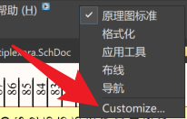
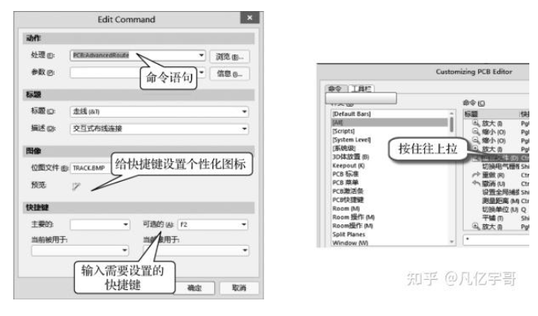

## 原理图库创建

在放置图形元素的时候使用10min，在放置管脚元素的时候使用100mil。

如果像上面这个一样，在创建的时候管脚移动不到图形元素上面去，那么就可以使用图形元素的线连接到管脚上去。

## 原理图的统一标号

之后再右键解锁全部标号

默认粘贴元器件会重置元器件位号变成问号，如果不需要的话可以在优选项中取消勾选这个选项

快捷键j可以有选项快速跳转到器件。

## 常见报错

把网络标签放在管脚上面也是错误的，放在前面是错误的，应该放在管脚和导线连接点的后面。

## pcb封装库

ctrl+M测量

shift+C清除测量

一般丝印设置5mil就可以了

## 异形焊盘创建

椭圆形等可以选择slot，然后去更改里面的一些参数。

像这种封闭的图形，选中一段，之后按tab，就会选中全部的线条了

整体思路就是需要借助pcb界面，之后画好一段形状后转换，之后再设置一下最小间距，之后选中边框，描绘选择对象外形，之后删除内层，线条宽度改成1，之后再创建阻焊层，期间的管脚号在里面放置一个焊盘就可以，之后再剪切到封装库创建界面中去即可。

或者不转换，后面把线条加粗。

## IPC封装创建向导

记得勾选下面的

否则3D模型就只有简单的，没有引脚。

## 3D模型

放置3D元件体是自己绘制，复杂一点的可以使用叠加，达到相应的效果。

在放置外界3D体的时候，记得把3D体的参数override color取消掉。

## 快速定义板框及DXF导入

### 1、手工绘制

先把器件全选，之后把他们集中放置，定义大概的位置

之后手动设置下原点，接着调到机械一层，画线，线条宽度一般是10mil，切换单位使用ctrl+Q,对线条长度进行调整，一般使用5的倍数

之后选中全部线条，D---S---D，定义板框

### 2、DXF文件导入

尽量导入低版本，使用2004版本

在新建文件粘贴的时候尽量在XY轴附近放置

然后在AD中进行导入

导入之后文字可能会被更改，在属性里更改一下就可以了

在视频中板框是被放在了机械2层，所以需要复制到机械1层去

选中板框，之后选中机械一层，快捷键EA，使用特殊粘贴

然后粘贴到当前层

有些不完整的地方复制的时候如果是在背面复制的，需要按X镜像一下

记得改线宽10mil

**定位孔记得不要忘记，还有就是要不要镜像的问题**

==不要忘记割槽，快捷键TVB==

> 适用场景：新画的板子，导入了dxf后板边框的原点在图纸的最左下，布局时元件不能拖动到机械层坐标负区
>
> 适用软件：ad17
>
> 方法：选中整个pcb，包括元件 机械层等等，按鼠标左键拖动到pcb图纸的中心区域，重新设置pcb的原点，此时，元件可以拖动到机械层的负坐标区，元件布线前可以放到板子的4周
>
> 建议：导入pcb的dxf版型后就将机械层拖动到板子中心，之后在去导入元件 网络等做设计
>
> 原文链接：https://blog.csdn.net/Vae_tomorrow/article/details/121568245

__________________________

> [PCB工作区的大小限制 | Knowledge Base 技术文档](https://www.altium.com/cn/documentation/knowledge-base/altium-designer/indicate-visual-cues-at-the-coordinate-limit-of-pcb-design-space-beyond-which-objects-should-not-be-placed)
>
> Altium将元器件的布局和布线限制在正/正象限内。您可以在右上象限中的一块十英尺见方的区域内放置电路板并对其进行操作。
>
> 如需确定绝对原点的当前位置，您可以使用Edit ► Jump ► Absolute Origin；此时，光标将跳转至原始Absolute Origin。您的所有操作均必须在该点右上方区域内进行。
>
> 如需重置原点，请使用Edit ► Origin ► Reset。您可以将当前所有工作内容移动至右上象限内，通过使用Ctrl+A进行全选，接着使用Edit ► Move ► Move Selection获得一个十字交叉线指针，然后，使用该指针单击参考点，并将十字交叉线移动至所需的参考点位置。
>
> 将电路板移动至右上象限后，您可以使用Edit ► Origin ► Set命令在最合适的位置放置一个相对原点，作为您的原点位置。

## 固定孔及器件的精准定义

一般固定孔都是3mm的非金属化孔

盘和孔都是等大的3mm

非金属，需要取消勾选plated（镀有......的）

移动器件快捷键M

孔创建好了之后可以先把它放在原点，之后进行XY轴的移动

这俩孔的定义一样，一个是切割槽，一个是用焊盘定义孔，但是需要注意的是板框定义在那一层切割槽就需要放置在哪一层

如果需要把固定孔精准定位，可以复制切割槽的坐标

非金属化就是钻孔里面不会镀有金属

精准定位的时候可以使用过孔作为辅助进行定位

## 层叠的定义及添加

层叠管理器：D---K

在层叠管理器的属性界面记得取消勾选Stack Symmetry，这个的意思的添加层的时候一次添加两层，但是添加的都会是正片层或者都是负片层，所以推荐取消勾选此选项，一层一层的去进行添加

负片层需要使用放置线条

在这个表格的左上角单机右键还可以对表格的表头显示进行更改，可以显示或者取消显示某些参数

## PCB交互式布局

在设置中取消交叉选择对象中的网络和pin脚，否则就会选中其他不必要的东西

T----O----L在矩形区域内摆放

### 自定义快捷键

在自定义快捷键的时候可能会和系统的发生冲突导致不起作用，右键工具栏选择customize

之后找到ALL，所有的快捷键都在这里了，找到该快捷键双击进去，之后去掉他就可以了

如果在PCB中的封装乱了，就进到pcb库中，之后单击右键更新所有就可以解决了

## 常用操作及快捷键

框选往左上角和往右下角滑动的区别

### 线选

> 
>
> 快捷键S,选择的意思，可以调出线选

移动器件的时候按住Ctrl+方向键可以移动

Ctrl+Shift+方向键可以大调

快捷键Ctrl+G可以调节步进的值

### 快速切换器件到顶层或者底层

一种是可以在属性界面更改

另一种更快捷的方式就是在拖动器件的时候按L，就可以切换层了

### 器件的联合

选中之后右键中的选项中找就可以

### 器件的锁定

在右侧属性的位置Location锁定即可

## 鼠线的打开及关闭

在复制pcb板的时候需要使用EA进行特殊粘贴，把==除了粘贴到当前层之外的选项==都勾上

有些铜皮什么的都使用单击右键查找相似对象进行删除

有些报错就使用TM进行清除

鼠线的亮度貌似没法调，只能和器件亮度一起调，快捷键   [   ] 

### 常规

> 使用**==快捷键N==**

### 非常规

> 首先按下快捷键L，调出这个界面，也可以在panels中调出
>
> 
>
> 关闭connection Lines就可以关闭飞线了，而且上面常规方法会没有用
>
> 还有一种情况就是在Pcb选项中没有选择Net而是From to Editor也会不显示，如果没有PCB界面可以在panels中调出来
>
> 
>
> 同时在这个界面还可以进行单个网络的打开关闭，首先选择Nets，选择Mark，这个会高亮显示，之后选中网络右键就可以选择连接显示或者关闭了，同时在最下面还有个change net color可以改变飞线的颜色
>
> 
>
> 在此界面还可以进行走线颜色的变更，**前面的复选框勾上就会走线的颜色变成飞线的颜色了**，勾选上了该网络的铺铜会变成像素状，放大了看才会是像素状，一般情况下就是选择的颜色。
>
> 多个同时变更可以选中以后右键----显示替换----选择的打开
>
> 
>
> 快捷键F5可以暂时关闭或者打开颜色

## Class的创建及应用

在PCB界面还可以进行差分线的添加

但是前提是需要在网络类管理器中先创建一个==差分类==，注意不是net class.

### 对于差分信号的添加思考

一种是像JHP那样在原理图中就添加好，另一种就是像凡亿教育这样先添加一个==差分类==，之后再在PCB选项中进行添加

## PCB布线的常用操作命令

### 1、同时多根走线

先添加类并添加好信号，之后先走线把线都印出来，之后线选或者框选中所有的线，使用快捷键U----M可以多根走线，快捷键Shift+R可以忽略障碍物进行走线

更改层的颜色在view configuration里面

### 2、元素的显示与隐藏

可以在view configuration里选择铜皮之类的元素

同时如果需要复制粘贴的话可以和选择过滤器一起使用

在U---U---C可以快速删除一整根走线

## 自动布线介绍

### 插件安装

插件安装之前需要选择这个离线安装，否则需要登陆

## 泪滴的添加与移除

快捷键T----E

## 局部铺铜和网络的添加

建议在设置中直接设置后，就不用后期更改了

先铺铜，之后再选择网络，之后再重新铺

## AD脚本的使用

快捷键F-----脚本

## 异形铺铜的创建

选中板框，之后选中需要铺铜的层，T----V----B，之后就可以了

## Cutout的放置和铺铜的修正优化

【【】】可以调整高亮的亮度

如果固定孔附近需要禁止铺铜，可以用线条先放置一个圆，之后转换命令里有非铺铜区域的选项，之后删除圆，重新铺铜即可

固定孔两面都需要禁止铺铜，所以可以再属性设置中选择多层

直角变钝角，快捷键P---Y,裁剪

## 常用规则

### 间距规则

单独创建线宽规则

### 布线线宽

### 规则的使能及优先级设置

优先级的设置这里不多赘述，在JHP的笔记中已经记录

走线的时候按快捷键Shift+W可以选择自己想要的线宽

### 过孔，阻焊及其他重要规则

设置好过孔的尺寸后，在第一次放置的时候需要按住TAB键更改尺寸，之后软件就会记忆，后面放置的过孔就是设置好的尺寸了，在规则中设置的尺寸只是在规则检查中使用

### 铜皮全连接及十字

### 差分规则

### 区域规则（Room规则）

这个就是创建一个单独的区域进行规则设置

放置的时候按TAB可以更改名字等参数

规则设置，线宽定义也和上图类似

  ### 规则的导入与导出

导入：规则----随便右键一个----Expert Rules-----全选-----确定...

导入：规则----随便右键一个----Import Rules----全选------

PCB规则重置

> 新建一个pcb，规则就是默认的了
>
> 之后导出，再导入到想要重置规则的Pcb

## PCB的DRC电气性能检查

停止检测建议填写50000

建议在线都打开

### 错误及解决办法

铜皮修改了没有重新铺铜，或者有没有用的铺铜

解决办法：先取消，之后按住Shift选中全部铜皮（可以先shift+s,之后再点选一个之后，切换到底层，按住shift多选），快捷键M往Y轴移动（获得xy偏移量）200mm，T----G-----A（所有的铜重铺），之后再移动回来，重新铺铜（重铺选中的铜皮）

但是我实测不知道为什么这么干没有用

经过测试，发现有个铺铜被隐藏了，把他取消勾选之后确定，重铺所有铜就可以了

如果双击错误不能跳转到具体位置

在设置中把这个地方拉到关闭

## PCB尺寸大小标注

快捷键P----D-----L（线性尺寸)

来到板框层，然后执行命令，空格键可以对方向进行更改，按tab键可以更改属性，单位一般使用mm

## PCB的点到点与边缘距离测量

快捷键Ctrl+L(这是点到点测量)

快捷键Shift+C可以清除测量

快捷键R----P(边缘间距)

如果需要测量线的长度，快捷键R-----S(测量选中对象)

## 器件位号丝印的调整

快捷键L（打开view configguration），只打开阻焊层和丝印层，之后单击右键-----查找相似，选择全部，在属性中打开Designator，然他们显示出来，这个地方需要选择器件才会出现下面这种界面

快速调整丝印到中心，ctrl+A全选所有器件，快捷键A-----P，定位器件中心

然后筛选只选Text

==定位器件文本一定要选择器件而不是丝印，否则按快捷键没有用==

## LOGO放置及二维码放置

### 脚本导入

> 脚本导入需要的是位图
>
> 另外大小需要在脚本界面去更改，或者在AD中更改也可以
>
> 首先选中LOGO,然后右键联合----从选中的器件生成联合，之后再次单击右键，选择里面的调整联合的大小

### 放置图片

在22版本提供了直接导入图片的选项，也得放位图

点击该选线之后线随便框一个尺寸，之后按界面操作就可以，对于大小的调节也是使用联合

总体来说放置图片更高清

## 多层线路及装配图PDF的输出

文件中的只能PDF

## 生产Gerber文件的输出

单位选择英寸，后面的几比几就是小数位数的选择，一般使用2：4，小数位数1位

要输出的东西太多了，后面有需要再仔细看吧

## AD中的三种栅格

AD共有3种栅格：可视栅格、电气栅格、捕捉栅格，作用是画图时，让零件、导线排列整齐好看。

Snap：捕获栅格，如果设定值是10mil，鼠标的光标拖动零件引脚，距离可视栅格在10mil范围之内时，零件引脚自动的准确跳到附近可视栅格上，捕获栅格也叫跳转栅格，捕获栅格是看不到的。

电气栅格：如果设定值是30mil，按下鼠标左键，如果鼠标的光标离电气对象、焊盘、过孔、零件引脚、铜箔导线的距离在30mil范围之内时，光标就自动的跳到电气对象的中心上，以方便对电气对象进行操作：选择电气对象、放置零件、放置电气对象、放置走线、移动电气对象等等，电气栅格设置的尺寸大，光标捕捉电气对象的范围就大，如果设置过大，就会错误的捕捉到比较远的电气对象上。电气栅格工作时捕获栅格不工作。捕获栅格和电气栅格：系统自动选择和切换。当光标准确的跳到电气对象上时，光标变成一个白色的八边形。此时就可以对电气对象进行操作了：移动、编辑。启动和关闭电气栅格的快捷键：shift+E，每次按shift+E键，在AD16屏幕的底部左侧都有显示。在PCB布线时按住CTRL键，可临时关闭电气栅格。电气栅格是看不到的。

可视栅格；在SCH 、PCB编辑中，可看到的栅格。可视摆放的零件整齐对齐。

在PCB板中， snap： 英文菜单中是snap(捕获栅格)， 中文菜单是：跳转栅格。 作用是保证零件的引脚对准到附近的可视栅格上。捕获栅格选择25mil最合理 捕获栅格的快捷键：shift+ctrl+G， 输入25mil最佳。当零件的引脚离可视栅格的距离进入25mil范围内时，零件引脚就能自动的对准到可视栅格上。

设置PCB板的可视栅格：在英文输入法下----- 在PCB状态下按G健------跳出数字菜单------选择一个数值(25mil最佳)------如果连续按两下G健------变成扑捕获栅格输入数值。栅格的值可在AD16屏幕底部左侧看到

PCB图的可视栅格 、捕获栅格、 电器栅格的设置，也可以在菜单view-----grids中进行设置。可视栅格最大，捕获栅格和电气栅格比可视栅格小。采用系统默认值即可。

切换栅格单位：按Q健切换，公制mm和英制mil

Snap x：单位是mil或mm，如果设定值是40mil，当鼠标拖动零件引脚移动，离可视栅格水平距离进入40mil的范围内时，零件引脚自动准确的跳到附近的可视栅格上。

Snapy： 单位是mil或mm，如果设定值是40mil，当鼠标拖动零件引脚移动，离可视栅格垂直距离进入40mil的范围内时，零件引脚自动准确的跳到附近的可视栅格上。

Componentx：移动零件时水平方向的移动步距，设置正确时，零件可以准确的跳到附近的可视栅格上。

Componenty： 移动零件时垂直方向的移动步距，设置正确时，零件可以准确的跳到附近的可视栅格上。

按G键显示可视栅格设置对话框，按CTRL+G键显示当前可视栅格的大小。

改变SCH零件库栅格：view-------grids ，将捕获栅格设为1，可视栅格设为10，也可以工具------docment-----option-----设置捕获栅格和可视栅格单位。

___

### **Altium Designer 20 Grids、 Guides、 Axes 三种栅格的讲解**

一、Grids栅格 是我们常用的、默认的普通栅格
Grids栅格常用的设置有：
1、快捷键 G 可以设置栅格大小

2、设置栅格的属性
Ctrl + G 设置粗、细栅格点或线显示，栅格颜色

在弹出的对话框中，在Display，Coarse选择Lines为栅格，Dots为格点，Do Not Draw为无任何显示。

3、新增自定义的区域栅格

栅格捕捉开关，去掉就捕捉不了这种栅格了

二、Guides栅格 用于捕捉我们放置的向导线(参考线)或点，如果没有放置是不起作用的。

常见使用方法
1、先放置向导线，可以放置4种线和一个点

2、打开捕捉向导线，snap distance设置捕捉范围，当鼠标在设定值（如下图50mil）半径范围内有向导线，则鼠标会吸附到向导线上。如果没有打开Guides功能，snap distance设置的值就是普通捕捉的吸附范围。

三、Axes 栅格 是用于电气点的对齐，电气点可以理解为焊盘中心、过孔中心、网络走线端点等 可以走带电气网络走线的点，只能用于水平或垂直对齐。举例子说明

例1：让过孔和焊盘处于同一水平线上，使出线是一根水平的直线
没有打开Axes 栅格时，焊盘和过孔不知道有没处于同一水平

打开Axes 栅格，并打开捕捉焊盘中心，当过孔和焊盘处于水平时会出线一根白色线，并且在Axis snap range设定范围内不会消失。
注意：只有当过孔和捕捉对象处于Axis snap range设定的范围内时才会出现白线

例2；走线打孔时让孔处在同一水平或垂直线上

注意：要对齐什么就要打开什么的捕捉，比如下面要对齐过孔则要打开过孔捕捉

用这个最大的好处是能让走线从焊盘或过孔处直直走出来，不会产生线头

完
————————————————

原文链接：https://blog.csdn.net/weixin_44599693/article/details/126181146

## 铺铜显示效果和颜色更改

最近看了稚辉君的开源项目，发现他的铺铜颜色很容易区分

上图就是铺铜会显示成网格状的，就是在PCB界面勾选了GND网络，就会变成这样，勾选就是把这个网络的颜色改成你设置的颜色，但是大面积铺铜会变成该层铜皮的颜色和设置颜色的混合像素状，其实也不止铺铜，大面积焊盘也会这样，我猜测器件焊盘也应该都会这样，但是目前还没有测试过。24.12.17更新：放大了看才会出现像素状，缩小了看就是选的颜色。上面的猜测是正确的。

[Altium Designer PCB的布线、铜箔出现网格状的像素点解决办法_为什么aultium designer的铜皮看上去是网格状的像素点-CSDN博客](https://blog.csdn.net/p1279030826/article/details/104710808)

另外在View Configuration界面，更改object cisibility中的transparency还可以调节明暗度。

### AD快捷键自定义设置

**1**

> （1）在菜单栏空白处单击鼠标右键，执行“Customize”命令，如图3所示。
>
> （2）打开如图所示的对话框，在左边栏中适配“All”，在右边栏中找到需要设置快捷键的栏目双击，如图所示，进入快捷键设置界面。
>
> 
>
> （3）在“可选的”栏中输入需要设置的快捷键，如“F2”，同时可以给设置的快捷键设置个性化图标，按住图标拖动到菜单栏上面，如图所示。
>
> 

**2**

> 把鼠标指针放置在需要设置的图标上，再执行“Ctrl+左键单击这个图标”，可以直接进入快捷键设置界面，如图7所示。同样按照上面的快捷键设置方法，完成设置。
