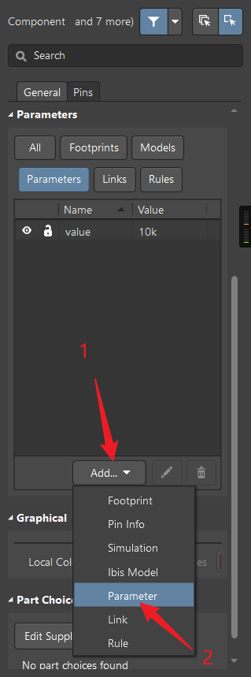
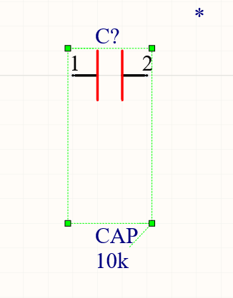
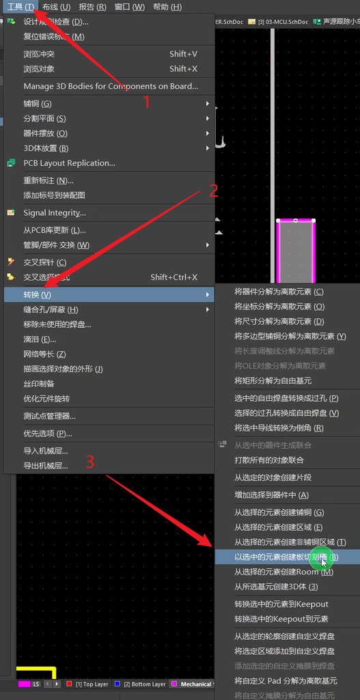
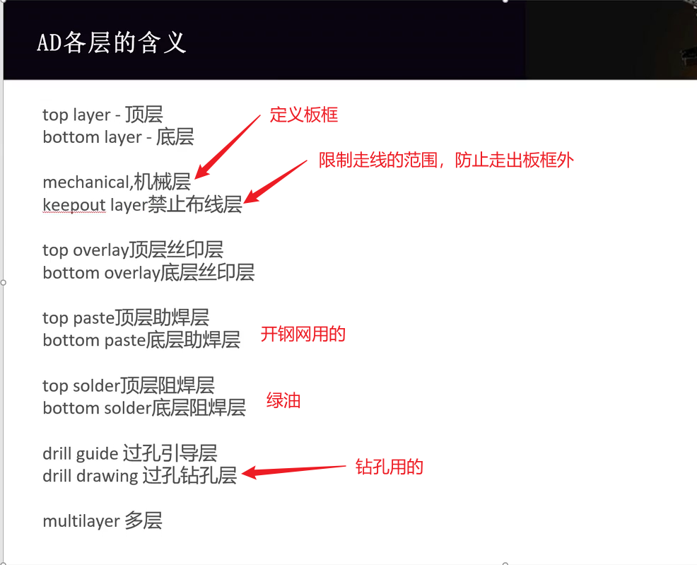
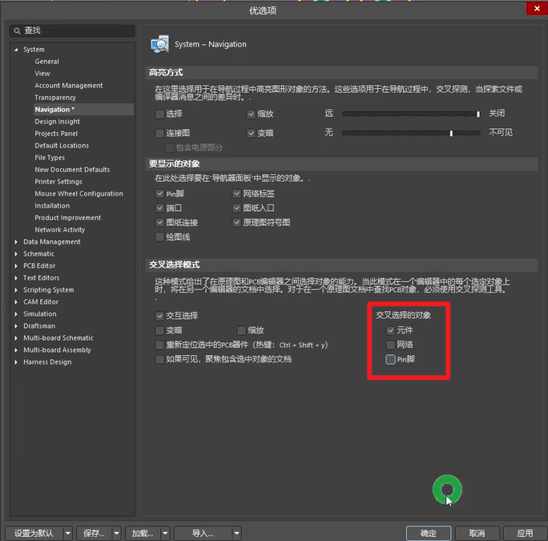

## 四层板层叠结构

.assets/image-20241003230151380.png)

> TOP BOTTOM：信号层
> GND PWR：参考层
> 除了参考层以外的都叫做信号层。
>
> 上图所示，方案一为常见四层PCB主选层设置方案。（适用大部分器件都放在顶层）
>
> 参考层就是用来参考的，信号层用电压传输信号，需要有一个参考点，一般用GND做参考会比较好。

## 正片层和负片层的概念

正片层：设计默认是无铜的，走线和铺铜的地方铜保留，其他地方的铜去除。

负片层：设计默认有铜，走线和铺铜的地方铜被去除，其他地方保留。

因为电源或者地会有好几种，负片层方便切割地方区分，之前电脑性能不够，动态铜皮卡，所以用负片层，负片层遇到不属于这个网络的可以自动避让。静态铜皮就是填充，不属于自己的网络不会避让。

目前负片层用到的较少。

## 热焊盘和反焊盘的概念

.assets/image-20241003233118728.png)

.assets/image-20241003233345733.png)

## 阻抗概念的引入

.assets/阻抗.png)

.assets/阻抗匹配.png)

.assets/影响阻抗因素.png)

.assets/image-20241004172200424.png)

.assets/image-20241004172816098.png)

## 各部分电路设计原理

> 这里简单做下笔记
>
> 咪头的原理就是通过一个电容和一个场效应管来输出信号，电容没有放电回路，一直保持充电状态，场效应管工作在放大区，D和S之间相当于可调电阻，振动会让电容的电压发生变化，从而D和S之间的电阻发生变化，再在其中一点采集电压，当然还有其他的一部分电路，其中电压出来后还需要进行放大处理，可以用三极管和运放放大，一般使用运放。这里需要再补模电的知识。
>

## 原理图库的建立

.assets/image-20241005104013762.png)

如果在1的位置缺少东西，可以在点击2中去选择。

在放置管脚的时候，白点朝外，而且要放在格点上，可以把捕捉栅格改成100mil，在切换成美式键盘后，快捷键shift+空格可以切换放置线条的方式，比如直角，45°，任意角度等。

 .assets/image-20241005113256249.png)

移动管脚的时候，捕捉栅格一定要设置成100mil，就是一个各自的大小，保证白点放在格点上。快捷键V->G->S（貌似不对，应该是V-G-G）。

多part元件模型创建：

.assets/image-20241005120507097.png)

多part元件创建是为了方便画原理图，比如运放芯片有8个引脚，两个放大器，画成两个三角型方便画原理图和看出来元件作用。

在放置管脚的时候，可以按TAB暂停，然后去更改一些属性。

## 安装外部原理图库

.assets/image-20241005142535327.png)

全选之后安装，上图仅安装了原理图库。相应的封装可以在封装管理器中一起添加绑定，比较方便，这点立创和他一样，也可以单独add footprint。

看了后面的课程，我的理解是SchLib是工程里面自己创立的，而SCHLIB是在AD里生成的原理图库，都可以在这里进行安装。同样的PcbLibd和PCBLIB和原理图库类似。其实都是一样的，没有放置3D模型在预览那里只能看见焊盘。

封装的3D模型需要自己去放置的，和封装是绑定在一起的，在安装封装库的时候里面是包括了封装和对应的3D模型的，没有的话就是需要放置，凡亿教育的课程中并没有教怎么导入外部库，而是拿着他们打开了直接复制调用。在本课程中导入了3D封装后就自动和原理图库绑定了，我猜测是因为他们名字一样。

## 原理图页的设置

> 双击原理图的边框，会弹出属性
> ==原理图可以设置多个==，在设置多个的时候可以在工程文件夹里新建一个文件夹存放原理图。

添加原理图库把文件放在工程文件夹里之后再添加已有的….

## 绘制原理图

在同一页原理图中，表示连接使用的是网络标签，不同页使用的是网络端口。但是在AD中都使用网络标签就可以了，在allegro中是需要这样的。

.assets/image-20241005210028230.png)

.assets/image-20241005204810761.png)

同样的，按住ctrl再左击，可以更改快捷键。

==**放置元器件的时候记得要把栅格尺寸设置成100mil，或者和原理图库里的元件保持一致，以保证白点在格点上，方便到时候连线。**==

选中元器件之后按shift拖动相当于复制一个元器件。

双击页面边缘可以更改图纸大小。

这个课程中原理图中元器件的值他改的都是comment，正常应该改value。

------

### 对于元器件中value的添加疑问解释

给元件设置value属性，value属性一般用来生成BOM表（见下图）时给元件分类（推荐），当然comment（注释）也可以用来分类（不推荐，但这样用也没问题），有人直接把它俩写成一样的。当然也有人喜欢把value填上阻容值，把comment填成备注信息的。还有人直接把value属性空着，直接在comment中填上阻容值的。

value其实属于该元件的一个参数parameter，默认元件是没有任何参数的，我们可以按上图添加一个自定义参数，并给参数命名和赋值。如果勾选上名称可见，那么在原理图中就能看到这个自定义参数名称，如果勾选上值可见，那么在原理图中就能看到参数的值。

这个直接百度或者在官方技术文档中了解：[使用参数管理器 | Altium Designer 22 技术文档](https://www.altium.com/cn/documentation/altium-designer/schematic-parameters?version=22#3e266f5652b3b91dc9477258ce53928c)

[altium designer怎么给原理图库添加value - 搜索 (bing.com)](https://cn.bing.com/search?q=altium+designer怎么给原理图库添加value&form=ANNTH1&refig=d70eeec062dd430dbf5f4db8eb93e34d&pc=HCTS)

对于为什么放置元器件的时候边框很大问题，如下图

这是因为原理图库里面下面有个不可见的东西，删除了就好了。

-----------------

.assets/image-20241006102808722.png)

在一页原理图中，网络端口和标号他都添加了，其中网络端口由于有多个，所以会在左侧显示蓝色字体部分，可以在右侧关掉。

.assets/image-20241006110857559.png)

最好网络端口对网络端口，尽管在AD中可以识别，但是为了规范还是需要在画网络端口。

## 原理图的统一编号设置

.assets/image-20241006113136299.png)

.assets/image-20241006113404064.png)

.assets/image-20241006113520272.png)

## 封装管理器

.assets/image-20241006114057213.png)

封装名字只是用来和封装库进行对应的，如果后续导入一个对应的封装库，他会自己根据名字对应。

## 原理图的DRC

.assets/image-20241006114501421.png)

.assets/image-20241006114633184.png)

右击工程，在工程选项里面。

第一个选项Validate PCB Project 就是进行DRC检测的。貌似在右侧的Message里面也有报错信息。

经我验证出现的就是这个，可能是因为版本的不同。

## 导出BOM表

.assets/image-20241006115846260.png)

第一个选项就是的。

.assets/image-20241006120002551.png)

这里可以选择导出哪些参数。

## 封装库的创建与封装的元素

画封装的时候快捷键==Ctrl+G==可以改变页面是否有栅格。

.assets/image-20241006153244353.png)

阻焊就是防止绿油覆盖的，阻焊内的铜不会覆盖上绿油。

.assets/image-20241006155747973.png)

测量距离，测量完了之后Shift+C取消测量。

.assets/image-20241006161613127.png)

在编辑里面有个特殊粘贴，可以阵列粘贴。

## 原理图导入PCB

在设计里的第一个选项，如果有错误可以先把错误报告导出来之后解决。

在更改封装时先移除之后再添加，接受变更，执行变更。

如果是从外界入PCB库或者原理图库，可以生成库之后再复制过去。

## PCB板框的评估与创建

.assets/image-20241006165538783.png)

可以把器件放在一起，方便后续操作。

板框层所在的层是机械一层。

==画板框==

1，先切换到机械一层，然后画一个需要的形状，比如矩形，但是目前板框仍然是黑色的那一部分，还需要进行后续操作。

2，全选线条以后再进行下面的操作。

.assets/image-20241006170237986.png)

------

快捷键==Shift+S==可以选择不同的层。

在机械层画的矩形，进行上面的操作切换成割槽，放东西用。

==shift+E==捕捉圆心。

双击会出现选择框，可以选择那一部分的东西。

一般在绘制完板框后，会再复制一下到keepout layer(禁止布线层)，防止线走到板框外面去。

## AD各层含义

注意top solder是负片输出，实际上有这个的地方不覆盖绿油

## 层叠结构的设置

.assets/image-20241006202654086.png)

.assets/image-20241006202957761.png)

更改原点：编辑->原点->设置

## 飞线（官方叫法：鼠线)

快捷键==N==可以选择隐藏飞线，在这里我认为选上相应的网络后就只会隐藏掉选上的这一部分。

.assets/image-20241006204025400.png)

### 全选丝印

先选择上一个丝印，之后右击查找相似对象，然后就可以全部选择上了。

记得选择Same，

但是此处JHP并未选择same,结果如图，在下面选择字体之后再进行更改也可以

之后快捷键A->定位器件文本

.assets/image-20241006211458347.png)

### 选择不上负坐标

重新放置下原点好像就可以解决

## 模块化布局规划

.assets/image-20241006211725205.png)

交互式布局

在原理图中选中这次元器件后，在PCB中会高亮，然后把这些重新放在一个小框内，非常好用，也就是得把上面的在矩形区域排列的快捷键熟悉一下。

可能会选上网络（相同网络的引脚或者焊盘等），在右上角的设置里把网络去掉就可以了

对齐操作的快捷键都在A里面

一个位置有多个元件可以双击他，之后会出现选择框。

注意有时候器件会被锁住，记得解锁。

.assets/image-20241006213341882.png).

 在垂直分割原理图和PCB之后，如果不知道PCB上的元件是什么，可以右击选择交叉探针，点击后原理图中的会高亮

在根据网络选择打开飞线的时候记得过滤器打开，要不会出现“？”

## 框选的方向

从上往下框选是全部框选到的才会选中

从下往上框选是碰到的就会被选中

## 交换器件

.assets/image-20241006221532642.png)

 首先选中两个需要交换的器件，用上面的任意一个试一下交换器件。

[关于Altium designer中各个层的讲解_toplayer-CSDN博客](https://blog.csdn.net/weixin_44557075/article/details/118965859#:~:text=本文详细介绍了PCB)

> Mechanical Layer顾名思义就是机械层，之所以强调“机械”就是说它不带有电气属性，因此可以放心地用于勾画外形、勾画机械尺寸、放置文本等等工作，而不必担心对板子的电气特性造成任何改变。
> 机械层的功能是可以根据自己的需求来定义的，以下是个人较习惯用的机械层定义：
> Mech1：机械一层多用来勾画线路板的边框，以及内部较大的镂空或者异型镗孔。
> Mech2：机械二层多用来绘制V型槽。
> Mech3：机械三、四层多用来放置辅助定义边界，以及特殊的分隔线。
> Mech5：机械五、六层多用来放置线路板的尺寸标注。
> Mech7：机械七、八层多用来放置各种描述文本，如板号名称、[版本号](https://zhidao.baidu.com/search?word=版本号&fr=iknow_pc_qb_highlight)、加工说明、设计者、设计日期等等。
> Mech13：AD默认用于描述器件的物理外形，也用于绘制三维实体。
> Mech14：同上。
> Mech15：AD默认用于勾绘器件的占位尺寸。
> Mech16：同上。
>
> 内部电源层(InternalPlanes) 通常简称为内电层，仅在多层板中出现。

## 创建集成库

上网搜

## Altium Designer制作原理图库不显示Comment和Designator

方法如下，就是在工具中的文档选项中勾选上显示这俩，因为这俩在参数那一栏找不到

目前我的感觉是pin脚上的文字位置无法修改

## 从立创导出的芯片原理图库方框会把引脚文字挡住的解决办法

选中画好的方框，在编辑中选择移到后面，在右键中并无相关选项，我认为这点不是很合理

## 放置网络标签

这个视频的做法是画出一根线之后再放置网络标。2024/12/12更新：正确做法确实是这样的，放在线上那条线就是该网络的，放在管脚上不是很对。

## 快捷键

镜像的快捷键是X和Y，但是需要在移动的时候才可以，不可以放置好了之后选中它按X,可以按住shift之后再点击X。

## Altium Designer中创建网络类、隐藏网络连线（CSDN）

在这里我的主要疑问是什么是AD中的网络类，在立创EDA中有类的定义，是用在拉线的时候定义走线的线宽，不用每次都更改。

看了这篇文章后[Altium Designer 20中创建网络类、隐藏网络连线_ad 20 编辑网络在哪-CSDN博客](https://blog.csdn.net/weixin_40379143/article/details/103075879)，这里AD和立创EDA都是一样的，这篇文章主要是创建类之后在布线的时候隐藏掉电源和地的飞线，只需要信号的走向。此处操作和立创EDA差不多。

那么，如何创建一个类呢？

==Step 01:== 使用快捷键DC，调出对象类浏览器；

==Step 02:== Net Classes右击添加类，重命名为Power,在电源类中，添加都有的电源网络，点击确定。

   类已经创建好了，那如何隐藏我们刚刚设置的电源类的网络连线呢？步骤如下：

  ==Step 01:== 点击面板Panels，勾选PCB选项，此时我们在右边就会看到我们刚刚创建的Power类；

  ==Step 02:== 我们右击Power类，连接→隐藏，就可以把我们刚刚设置的电源类的连线都隐藏掉啦！

## 覆盖区，编译屏蔽

此处是门控器的原理图中他们画的编译屏蔽

编译屏蔽的三角有红色填充，覆盖区没有。

覆盖区的作用就是快速直接定义网络类，方法如下节。总线貌似也是这个功能，再定义网络类的时候会更快捷。

## Altium Designer按区域定义原理图网络类功能

采用覆盖区指示器使得网络类的定义省时省力且视觉上直观整洁。

下面来介绍由覆盖区指示器创建网络类的方法：

> 1.执行“放置”—>“指示”—>“覆盖区”，快捷键（PVL），放置一个覆盖区，这个覆盖区框住的网络就是你想要归为同一个网络类并导入到PCB中去的网络。
>
> 2.然后放置一个定义网络类的“参数设置”到该覆盖区的边上。快捷键（PVM）
>
> 3.鼠标左键双击打开刚刚放置的“参数设置”，在弹出的对话框中找到“Classes”一栏，点击“Add”,新建一个Class并给它命名。
>
> 4.设置完毕后，进行导网络变操作，将原理图更新到PCB，操作方法按正常操作。在工程变更指令对话框可以看到添加网络类的指令。
>
> 5.更新过去之后，我们查看PCB中的网络类，会发现已经创建好了一个名为“DC”的网络类。并且将覆盖区内的所有网络归为了同一类。
>
> 你也可以拷贝覆盖区边界上的“参数设置”指示器，并粘贴到其他的覆盖区指示器周边，或者粘贴到单个的连线、总线或线束上，其结果是所有这些粘贴上同一个“参数设置”指示器的网络都会被归为同一个PCB网络类中。您可以采用拷贝粘贴“参数设置”指示器的方法来添加更多的网络成员到同一个网络类。
>
> [Altium Designer18 AD19 AD20按区域定义原理图网络类功能 - 哔哩哔哩](https://www.bilibili.com/read/cv4603502/)

## 疑问区

封装放置中心点,这个我后面试了下，放置中心就好了

3D模型用sldrp文件会保留颜色。

还有就是画封装时候的问题（当时忘记了写具体问题了）

## 布局

在这个视频中，开始的时候板子上的负坐标的东西是选不中的（貌似是全选的时候不可以直接一起选中），解决办法是把器件先能选的全选了，之后再按ctrl选中负坐标的，移动到正坐标那边去，或者剪切粘贴也可以，但是需要注意的是需要在移动之前如果有东西被锁定了需要先解锁，之后再进行操作，之后再设定板框，最后就是把原点重新设置一下就可以了，为什么需要这样我也不知道。

定位追踪快捷键shift+E

## AD设计规则

和嘉立创EDA类似的

差分线需要计算，推荐使用嘉立创阻抗计算神器

之后使用交互式差分对布线会比较好，但是前提是需要在原理图中设置好差分对,当然也可以在类管理器中设置差分信号

## 类管理器及规则设置

设计---->类

在规则管理器中先在线宽那里右键添加一个新规则，之后再选择Net Class，PWR

规则之中也存在着优先级，走线的时候先适配优先级高的规则

设计规则检查器可以选择在线的，工具---设计规则检查

## 多层次原理图注意要点

电源端口网路名称是全局的，子图中的port不可以和他重名

其实就是电源端口不用网络端口连接

> 在编译我的项目原理图时，我收到一个警告：“全局电源对象…由于在…上存在端口，已降低到本地级别。”这是验证项目后消息面板中出现的警告。
>
> 电源端口是全局的（除非在项目选项中网络标识符范围内单独设置），并且不需要连接到额外定义的端口才能连接到另一个原理图文档。当全局电源端口连接到本地端口时，它会将电源端口降低到本地级别。解决方案是删除电源端口和本地端口之间的连接。

有的网络端口定义的有I/O，output,input，而有些器件管脚和这些对应不上，导致会出现warnning,我的感觉是不需要管，因为像是电阻电容修改了后其他的就又会对不上了，但是我看网上有些更改为passive就不会出现问题了，但是我的原理图电阻电容管脚都是passive但是也没有用，可能是因为版本的问题。

在AD中的一个芯片连接了5v电源，并且引脚类型是input，导致编译的时候显示Net 5V has no driving source ，后面在原理图库中将该引脚改成passive后warnning消失。在此我试了下，应该是有input就需要有output，否则就会报错

## PCB布线注意事项

### 过孔扇出

3W原则：假如线宽是6mil，==中心间距==就需要18mil，而设计规则中的是Track到Track,也就是线边到线边，所以就应该设置成12mil就可以。但是不是所有的线都需要遵守这个原则，可以搭配Class来使用，重要的线用这个原则。

### 模块内部的走线

ctrl+左键点击可以高亮同网络的焊盘，取消的话按住点击空白区域

==铺铜后打过孔的时候担心打到焊盘上，可以快捷键ctrl+d调出view configuration,调节铺铜透明度即可，==有些走线也可以这么做

有时候铺铜选上网络了也铺不上铜，可能是因为该网络选择的是十字连接，二者间距太小，连不上，

这里up主的做法是复制该网络，之后加到PWR网络类中去，（提前设置了PWR使用全连接了）

另外有时候铺铜的时候会有缝隙，如下图

因为避让了走线，所以有缝隙，解决办法如下图，选择铺所有的铜即可

有时候走线和铺铜会弄到板框外，解决办法是把机械层的板框复制一下，之后使用E---A，特殊粘贴，复制到keepout层中即可，铺铜还得勾选去除死铜才可以，要不板框外面会有死铜。

如上图，注意不要所有的铺铜都打过孔，电流是有路径的，如果打到滤波电容后面了，就没法滤波了。

有时候走线会跟随上一次的线宽走，在如上图设置中更改下即可。

自动打孔切层网上搜快捷键即可，记得换成英文输入法

### 电源层处理

在pcb中选择nets,更改网络颜色后，变成格点这种，可以更改

在设置--PCB Editor--Board Insight Coloe...改成实心覆盖就会变成实心的了。
先布简单的，后布复杂的，可以先从顶层底层走一部分电源线，复杂的pwr层铺铜

### GND层处理

这个课程没有区分模拟地数字地，直接铺铜的

顶层和底层也会铺GND的铜

如何快速看是否还剩下的有飞线

在PCB界面中，选择NETS，上图箭头所指位置如果是0，就是没有飞线，或者后续drc也可以检测出来

这个课程的电源和底层都是正片层

