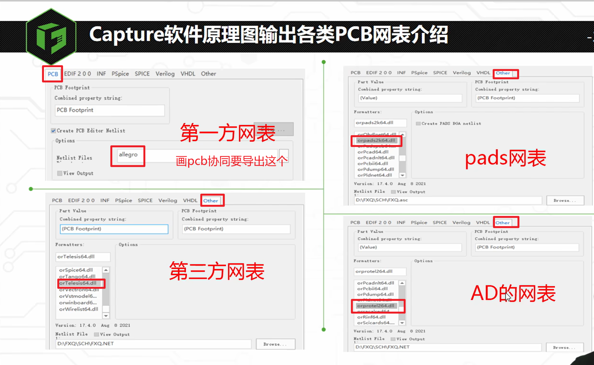
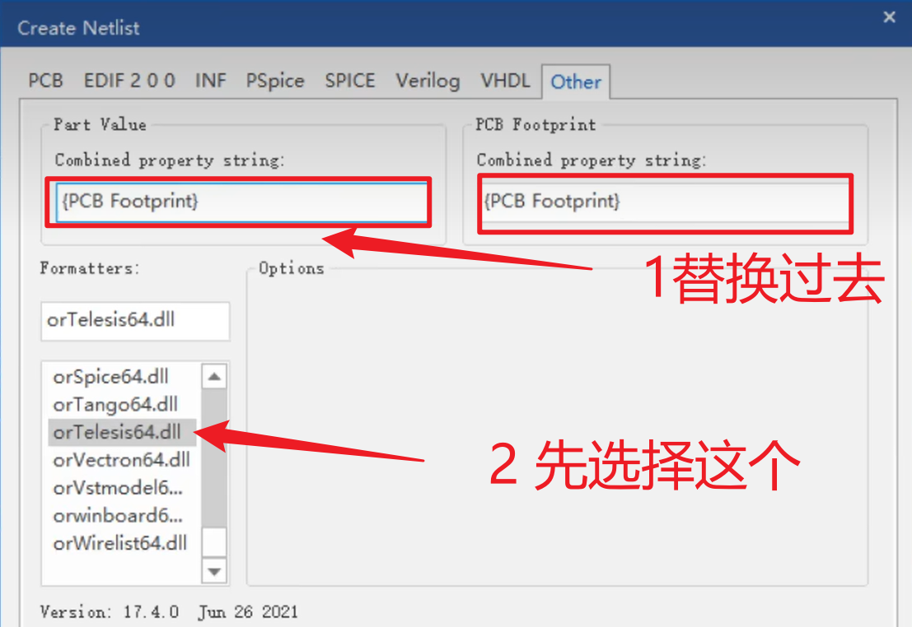
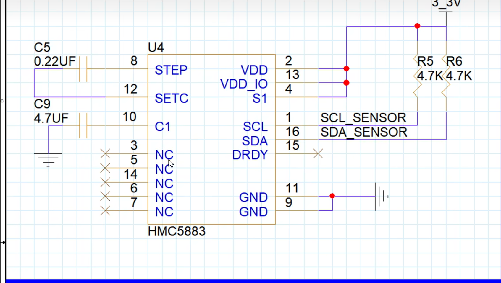
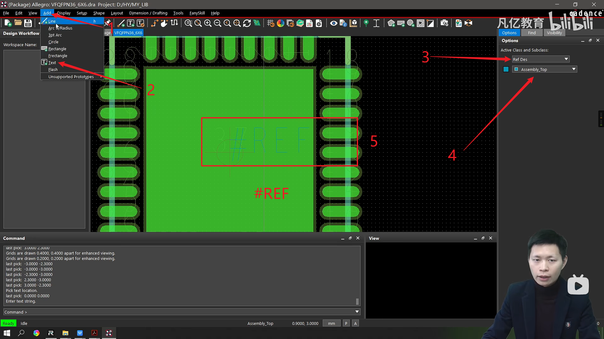

## Capture软件操作界面及常用设置

### 启动软件的更改

在File---change product中，可以更改启动的设置

$\color{blue}{一般都是使用OrCAD capture CIS，这个的功能比较全}$

### 系统颜色的更改

Option---perference

在这里可以进行系统颜色的更改

格点设置也是在preference中，有个Grid Display，可以在这里面进行更改，分为两部分，原理图和原理图库的格点

前面的复选框是打印的时候用的

## 自带元件库介绍

存放位置：安装目录--tools--capture--library

具体每个库都是干什么的在ppt中有，需要的时候进行查阅即可

## 创建元器件库

File--New--Library，文件后缀是olb

如果路径不满意，可以Flie--Save as另存为,==不建议放在中文路径下面，会出问题。==

**注意这个创建的是一个库，不是一个元器件**

### 添加元器件

右击新建好的库--New Part

页面的放大缩小快捷键O，I

或者Ctrl+滚轮

放置管脚的时候不用分太细，shape中的Dot表示低电平有效，Order表示旋转的角度

放置管脚可以单个放置也可以阵列放置

阵列放置的可以用负号进行递减

例如上图左边就是递增放置，右边是递减放置

之后进行Editor pins进行统一更改名称,==注意更改的时候默认顺序是比如1-18，36-19，==记得注意看

这里面的Value值是可以进行更改的，因为是芯片，如果是电阻电容等就需要在放置到原理图的时候进行更改

## 元器件库的管理与调用

先随便单击一个器件，之后按R,就会定位到这个地方了

复制粘贴过来后，不知道为什么会出现三个而且删除不掉，这个老师在视频中也没有讲怎么处理的，我试了下发现是先yes，之后no，后面是问你要不要删除整个包。

### 通过原理图获取库

打开原理图里面会有个Design Cache,里面有库文件，直接复制粘贴过去就可以了

双击原理图的元器件可以看到详情，如上图，但是不知道为什么我的点击出来是横的，他的是竖着的

调用原理图库的时候在原理图界面点击place--part--之后点击添加图案就可以了

## 元器件库与PCB封装库关联

一种是在元器件库中右侧属性栏直接在package中填写，或者是在原理图中进行更改，这个是在后续的课程中

## 原理图

### 原理图的新建、添加

新建：File--New--Project，之后出现的框一个是名字，一个是位置

新建工程会自动出现原理图，新建原理图也会自动出现工程，OLB文件可以后续添加

添加库文件就是在左侧的Library中右击Add Files,这个和上面的在右侧place...添加效果是一样的，但是用place-->Part默认位置是官方的那些库

### 添加元器件

dsn文件的名称在软件中是不可以直接重命名的，要么save as,要么就是关掉软件后在文件资源管理器中去重命名。

下一层级的两种是可以重命名的。

更改纸张大小右键相应的原理图，选择Schematic...，之后单位选择mm才能看到A4等，单位是inch貌似纸张大小和mm单位表示不是一样的。

### 放置元器件

Place-->Part-->添加元器件库（不添加也可以）-->之后右侧上面双击想放置的元器件即可，这个放置之后是立即进行编号的（单击器件之后再按键盘就可以快速跳转到首字母为这个的器件，好像是单机下就可以了，忘记了是不是单击之后不松手了）

旋转元器件快捷键R，或者右击元器件-->Rotate

镜像元器件快捷键Edit--Mirror，需要先选中元器件，要不是灰色的，快捷键是H和V。（其实右键就有相关的选项了）

对齐：Edit-->Align-->中心对齐等等

连线快捷键W,放置网络标号需要先用线引出来

和AD不同的是，Orcad的不同页原理图之间网络要用分页符进行连接，用网络标号是连不上的

==搜索快捷键Ctrl+F，需要先点击一下左侧的dsn文件,才能搜索多页原理图==

### 电源和地的联通

> 1.系统自带电源和地连接符的库（CAPSYM），不用添加，直接放置即可
>
> 2.电源和地是全局变量，不同的页面也可以自行连接，不用添加分页符

电源和地如果管脚定义是power了，是不可以放置no connect的

no connect直接删除是删除不了的，需要双击该管脚，之后会弹出来一个界面，将Is no connect前面的勾取消掉就删除了

放置：Place-->power/Gnd，或者点击右侧的小图标也可以

### 原理图添加BUS总线

添加总线作用目前我所知道的就是会看起来网络比较直观，后续画PCB应该也是有点作用的，但是目前我还不知道(同组同层布线，或者有时序要求的时候有用)

> 如何添加BUS总线
>
> 1，place-->BUS(或者快捷键B)
>
> 2，放置完总线后还需要添加名称，Place-->Net Alias
>
> 名称有特定规则，具体参考上图
>
> 3，放置网络标号，需要先添加总线入口，place-->bus Entruy
>
> 如果放置了no connect,需要双击管脚，之后弹出来的表格中取消勾选is no connect即可

### 原理图添加差分属性

​	添加差分信号需要先选中一页原理图，要不相应选项会是灰色的

> 1、鼠标左键单击选中一页原理图，然后执行菜单 
>
> 命令“Tools-Create Differential Pair...”， 
>
> 2、在弹出的Create Differential Pair窗口中查 
>
> 找需要设置的网络名并添加到Selections中； 
>
> 3、在①箭头处输入需要查找的大概网络名； 
>
> 4、在②箭头处选择具体对应的网络名； 
>
> 5、点击③箭头处的符号即可添加到Selections中； 
>
> 6、点击④箭头处的Create即可自动创建好差分类。

这个界面是双击网络得到的，但是不知道为什么总线里的网络无法双击出来，先放在相应网络名下面的线上之后双击即可

### 原理图PCB Footprint处理

一种是类似于芯片，可以在创建原理图库的时候就在右侧把封装名填上去，电阻电容等就是需要原理图建好后双击器件之后在弹出的页面中进行添加；我的想法是可以多建几个不同封装的电阻电容，省的一个个添加的

### 原理图DRC检查工具介绍

 先点击左侧的dsn文件(选择根目录）

PCB-->Design Rules Check

DRC检测文件不能放在中文路径下面，会报错

运行后会在左侧的output文件下出现一个文件，双击可以打开

报错的地方会出现绿点，如果想要去掉的话可以在上图中的DRC Action中选择清除DRC标记

==相应规则的设置在Rules Setup中==

> 24.1版本无法运行DRC解决办法：[hotfix spb 23.10.001，7天有效 - 第4页 - Cadence Allegro论坛 - EDA365电子论坛网](https://www.eda365.com/forum.php?mod=viewthread&tid=737349&page=4#pid2955909)
>
> OrCAD 23.10.S001补丁 运行不了Design Ruler Check的问题解决了，可以打开软件安装路径下比如C:\Cadence\SPB_23.1\tools\bin，修改orCefSettings.ini文件，添加一行lang=en-US 保存即可，注意关闭软件情况下修改。

> **DRC报错信息：**
>
> u Check single node nets：检查设计中的单端网络； 
>
> u Check no driving source and pin type…：检查器件属性无源管脚与有源管脚的连接是否正确； 
>
> u Check duplicate net name ：检查重复的网络名称； 
>
> u Check off-page connector connect：检测分页图纸间接口的连接性； 
>
> u Check hierarchical port connection：检测阶层端口的连接性； 
>
> u Check unconnected bus net：检测没有连接的总线网络； 
>
> u Check unconnected pins：检查没有连接的管脚； 
>
> u Check power pin visible：检测电源属性的管脚是否显示了管脚名称与编号； 
>
> u Check missing/illegal PCB Footprint：检测封装名称是否填写。是否含有非法字符； 
>
> u Check Normal convert view system：检测一个部件的正常视图上的pin号是否与转换视图上的pin号不同； 
>
> u Check incorrect pin group assignment：检查同一个Pin Group的所有插脚是否有相同的类型； 
>
> u Check high speed props syntax：在设计中检查网络高速属性的语法是否正确； 
>
> u Check missing pin number：检测缺失管脚编号的管脚； 
>
> u Check device with zero pins：：检测设计中是否含有零宽度的管脚； 
>
> u Check power ground short：检测一个Part内部的电源网络名称是否有两个不同的网络标号名称； 
>
> u Check Name Prop consistency：检测层次原理结构中是否含有相同的网络名称； 
>
> u Report all net name：报告所有网络的名称； 
>
> u Report off-grid object：报告不在格点上是器件； 
>
> u Report hierarchical ports and off-page connection：报告阶层端口和分页图纸间接口的连接； 
>
> u Report Misleading Tap Connection：报告易误解的连接。 
>
> u Report Visible unconnected power pins：报告所有具有可见电源属性的管脚是否有连接； 
>
> u Report unused part packages：报告原理图中未使用的器件part； 
>
> u Report invalid Refdes：报告原理图中无效的器件位号； 
>
> u Report identical part references：报告原理图相同的位号。

**==检查单端网络是比较重要的，cadence中多页原理图不同页之间的信号要使用分页符，如果不使用，在两页原理图中它会自动加上后缀==**

Check power pin visible：检测电源属性的管脚是否显示了管脚名称与编号；  （这个问题不太重要）

 做原理图库的时候这个管脚设置了电源属性，但是管脚号和管脚名称可能没有显示出来，可以右键这个器件，编辑器件，选择这个管脚，在右侧属性中勾选Pin Visible即可。没有显示的话就是这个被取消勾选了。

这个界面试选择是报错误还是警告，一般不需要进行更改

### 原理图PDF与BOM清单

输出PDF有两种方式**注意这些操作之前都需要在左侧选择点中那个dsn文件**

第一种方式需要用到插件，没有安装插件就会出现下面这种报错

解决方法就是百度下载这个插件下载安装之后，注意记住安装路径，在converter Path选择这个路径即可，红色报错就会变成绿色

生成后会生成三个文件，后缀为PS的，选择CapOutput.ps这个文件，选择pdf工具打开就可以

第二种方法就没有什么注意点了

==BOM清单==

 想要输出封装的话需要在Header那一栏后面加上\tPCB Footprint,在Combined property string这一栏加上\t（PCB Footprint）

 ### 输出各类PCB网表

网表导出有很多种

导出的网表会在当前目录生成一个allegro文件夹

**==在导出第三方网表的时候需要注意；在Part Value那一栏，由于allegro非常严格，不能识别小数点括号等，所以需要进行替换成PCB Footprint,具体见下图==**

allegro的第三方网表是.NET文件

导出pads和ad的网表不需要在Part Value那一栏使用Footprint进行替换，这俩软件可以识别的出来

### Capture软件原理图输出网表常见错误解析

**常见错误解析**

> 
>
> 重复网络名称的解决方法是把GND改为电源属性，电源可以重复网络名称
>
> 非法字符那个这里显示的是库的路径中包含非法字符，解决方法如下：
> 
>
> 在右侧的Design Cache中可以找到这个器件的来源
>
> 一般的解决方法是新建一个库（File->New->Library)，记得保存下，之后点击Design Cache中的那个出问题的库，右键复制，之后点击新建的库，右键粘贴，再之后在Design Cache中右击Replace Cache
>
> 
>
> 

注意在log文件中错误不是只有显示的那些，重新导出网表可能还会有错误。

像这种都是好几个管脚是NC的或者是GND的可能会报错引脚名称重复，解决方法是点击选中器件，鼠标右键->Edit part,像GND这种电源管脚可以更改Type为power,但是像NC这种的，==注意，不是电源管脚的一定不要定义成电源管脚==，解决方法是编号成NC1,NC2....

最后一个问题是不需要解决的

## Class和Subclass

其实就是大类和小类，包含关系

常见的：

> Board Geometry:
>
> Outline-板框
>
> Silk…-丝印层
>
> Soild…阻焊层

> Drc error class:
>
> 报错信息显示

> Package Geometru:
>
> Place_Bound_Top-虚拟的占地面积，辅助设计用，实际光绘文件里没有这个
>
> Silk…-这里面也有丝印层，实际添加在哪里都一样，因为最后的光绘文件里这两个都添加了

> Allegro中的Class和Subclass
>
> **Class 和 Subclass 的定义**
>
> **Class** 是对象的主要类别，例如板框、封装、铜皮等。每个 Class 下可以进一步细分为多个 **Subclass**，用于更精细地管理对象。例如：
>
> - **Board Geometry** 是一个常见的 Class，其中包含 Subclass，如丝印层（Silkscreen_Top）、装配层（Assembly_Top）等。
> - **Etch** 是另一个 Class，用于管理电气层，其 Subclass 包括顶层（Top）、底层（Bottom）等。
>
> 这种分类方式类似于学校中的年级（Class）和班级（Subclass），每个学生（对象）都归属于某个年级和班级。
>
> Class 和 Subclass 的作用
>
> 通过 Class 和 Subclass，可以实现以下功能：
>
> - **对象管理**：将不同类型的对象分组，便于查看和编辑。例如，顶层丝印和底层丝印可以分别归类到不同的 Subclass 中，避免混淆。
> - **属性控制**：对不同的 Subclass 设置特定的属性，例如颜色、线宽等。
> - **层次化管理**：通过细化分类，便于在复杂设计中快速定位和操作特定对象。
>
> 如何查看和操作 Class 和 Subclass
>
> 在 Allegro 中，可以通过以下方式查看和操作 Class 和 Subclass：
>
> - **颜色面板**：在颜色设置界面中，可以查看所有的 Class 和其对应的 Subclass。
> - **选项面板**：在左侧选项面板中，也可以找到相关的分类信息。
> - **添加或删除 Subclass**：通过菜单中的 Subclass 设置，可以为某个 Class 添加新的 Subclass，或删除不需要的 Subclass。
>
> 例如，若需要在 **Board Geometry** 中添加一个新的 Subclass（如 DXF 图层），可以通过菜单输入名称并确认添加。
>
> 注意事项
>
> 
>
> - **名称的意义**：Class 和 Subclass 的名称本身没有实际意义，关键在于 Allegro 如何使用这些分类。例如，虽然 **Etch/Top** 通常表示顶层铜箔，但这只是系统默认的约定，用户可以根据需要重新定义。
> - **系统管理的 Class**：某些 Class（如 Pin 和 Via）由系统自动管理，用户无法直接修改。
>
> 
>
> 其实Allegro将所有元素都分类的很仔细是方便后期的操作，我觉得建立了Subclass其实就是对每个Class的一个细化，比如在Board Geometry中有丝印层silkscreen_Top,在Package Geometry也有 silkscreen_Top。而在AD中silkscreen_Top就只有一层了，所以假如我选择了对Board Geometry中有丝印层silkscreen_Top的任何编辑都不会影响，Package Geometry的 silkscreen_Top。
>
> 
>
> 换句话说，其实就是allegro把不同元素细化，方便各个对象管理和控制。
>
> 《一》初步认识class和Subclass
>
> 这里主要讲我们PCB常用的class，以及subclass，其他class和subclass用的不多，在大家熟悉软件做项目多了就加深印象了，后面的叠层设置和项目实战系列加深class和subclas的理解。
>
> 刚入门allegro常接触的几个class是下面板框、封装、铜皮、位号这几个大类
>
> 
>
> 常见的Class
>
> 常用的subclass是顶层丝印、底层丝印、装配层、placebound、顶层开窗、底层开窗、顶层paste、底层paste层。
>
> 
>
> 常用的Subclass
>
> 《二》查看class和Subclass
>
> （1）在颜色面板可以看查看Class和Subclas
>
> 
>
> （2）在左边的选项面板中可以查看
>
> 
>
> 《三》添加和删除subclass
>
> 在上一节添加DXF的时候我们可以添加对应的层，但是我们不可能每次都要无缘无故找个DXF来添加subclass，那样太麻烦了。
>
> 比如我需要添加一个DXF的图层，我计划添加在Board Geomtry里面的添加一个DXF subcalss，方法如下：
>
> (1)Stup菜单中选择Suclass
>
> 
>
> (2)进入菜单后，找到我们需要加的Board Geomtry，然后在右侧的弹出的菜单输入DXF，按Enter即可。
>
> 
>
> Subclass添加界面
>
> （3）如果需要删除subcalss，前提是确保您的PCB上没有调用任何该subclass的元素，否则删除会失败，但是系统会提示您它的位置。如刚刚我们添加的DXF需要删除就点击左侧 -> 的这个按键这里就可以删除了
>
> 
>
> DXF删除界面
>
> **Geometry**
>
> **Board Geometry**
>
> 在板子上的图形，在板子上添加的标识、说明、注释等信息应添加到该类的子类上。
>
> - Assembly-Det[ai](https://www.elecfans.com/tags/ai/)l和Assembly-No[te](https://www.elecfans.com/tags/te/)的使用与装配有关.Assembly_Detail用于指示装配细节，比如器件在PCB上进行固定的规程等.Assembly_Note可以标注装配的注意事项.
> - Both_Rooms，Bottom-Room，Top-Room，Pl[ac](https://www.hqchip.com/app/1703)e-Grid-Bottom，Place-Grid-Top与自动布局有关，具体可以参见自动零件摆放的说明。
> - Silkscreen-Bottom和Silkscreen-Top分别为Bottom层和Top层丝印，某些情况下比如需要在PCB板标注某个[电位器](https://www.hqchip.com/app/1261)的含义，以方便调试或操作时，可以此层添加对应图形
> - Constraint-Area用于在设计中指定特殊的布线区，在这些布线区中可以设定特殊的布线规则
> - Dimension用于标注设计中的有关尺寸.
> - Off Grid_Area用于指示设计中不使用栅格的区域。
> - Outline用于绘制PCB的外形（板框）.
> - Plating-Bar用于指示设计中需要电镀的地方，比如很多采用金手指的设计中可以用Plating-Bar来指示需要镀金的金手指条
> - Soldermask_Bottom和Slodermask_Top用于设计在Bottom层和Top层添加阻焊窗，即添加不需要俗称绿油的区域.
> - Switch_Area Bottom和Switch_Area-Top用于指示可以将区域内零件的摆放进行交换的区域。
> - Tooling-Corne[rs](https://www.elecfans.com/tags/rs/)用于指示某些需要加工的转角等。例如在某些设计中，在PCB的外形中有拐内角的地方，虽然设计中是一个直角，但加工完成后则是一个圆弧角。如果设计中没有考虑这个尺寸余量将导致零件无法装配.‍
>
> 
>
> **Package Geometry**
>
> 在焊盘图形中的图形，在焊盘图形中添加的标识、说明、注释等信息应添加到该类的子类上。
>
> - ASSEMBLY-TOP和ASSEMBLY-BOTTOM是与装配相关的内容，表示的是零件的外形和方向。
> - PLACE-BOUND-TOP和PLACE-BOUND-BOTTOM表示的是零件在Top层和Bottom层各自占位大小，在同一层中如果两个零件的PLACE，BOUND区域有交叠将发生DRC错误。
> - [PI](https://www.elecfans.com/tags/pi/)N-NUMBER用于表示零件的引脚号的显示。
>
> 
>
> **Manufacturing**
>
> 
>
> - PHOTOPLOT-OUTLINE用于指示在生成Gerber文件时的指定区域，区域外的将不做输出
> - NO_GLOSS_ALL，NO_GLOSS_BOTTOM，NO_GLOSS_TOP，NO_GLOSS INTERNAL.分别用于指示所有层、Bottom层、Top层、内层（非Bottom层和Top层）禁止使用GLOSS功能.
> - NCDRILLFIGURE用于指示设计中钻孔（包括通孔，盲孔和埋孔）。对于不同规格的钻孔NCDRILL-FIGURE用不同的符号标识.NCDRIL-LEGEND用于统计NCDRIL FIGURE标识的各种规格钻孔的Class型与数量.NCDRILL_FIGURE和NCDRIL LEGEND相结合可以指导钻孔的加工.
> - AUTOSILKTOP和AUTOSILK BOTTOM指的是在Allegro中通过Auto Silkscreen命令生成的丝印
> - NO-PROBE-TOP和NO-PROBE-BOTTOM，以及PROBE-TOP，PROBE-BOTTOM分别为Top层，Bottom层禁止飞针测试区和Top层，Bottom层飞针测试区.
>
> 
>
> **Drawing Format**
>
> 用于在设计中添加技术说明，以告诉制版厂其他的一些加工信息，如叠层结构、板厚的容差等
>
> **Stack-Up**
>
> 
>
> DRC：设计中的错误报告显示
>
> ETCH：导体蚀刻层，与设计层数相关，代表PCB各层的导体图形
>
> An[ti](https://www.elecfans.com/tags/ti/)-ETCH：与ETCH相对，与设计层数相关，当使用split plane create命令时，如果此层有图形，则生成的Shape将避开对应的图形，常用作Plane层面的分割
>
> Pin：焊盘图形中的引脚相关内容
>
> Via：PCB和焊盘图形中通孔的内容
>
> **Components**
>
> Refdes：[元器件](https://www.hqchip.com/ic/0)显示字符，对应到原理图对元器件定义的位号属性
>
> ComponentValue：
>
> Device Type
>
> Tolerance
>
> User PartNumber
>
> **Areas**
>
> 
>
> Route Keepin：允许布线区
>
> Route Keepout：禁止布线区
>
> Via Keepout：禁止放置Via区
>
> Package Keepin：允许布局区
>
> Package Keepout：禁止布局区
>
> 1.STACK-UP(层叠)
> 1.Pin：焊盘图形中的引脚相关内容
> 2.Via：PCB和焊盘图形中通孔的内容
> 3.ETCH：导体蚀刻层，与设计层数相关，代表PCB各层的导体图形
> 4.DRC：设计中的错误报告显示
> 5.Anti-ETCH：与ETCH相对，与设计层数相关，常用作层面的分割
> 6.Boundary:边界，基本上没有图形
>
>
> 2. Areas（区域）
>    1.Route Keepin：允许布线区（经常用于outline内缩10mil，用来限制布线区域）
>    2.Route Keepout：禁止布线区（经常用于PCB封装时电感下方的区域内，不能布线）
>    3.Via Keepout：禁止放置Via区
>    4.Package Keepin：允许布局区
>    5.Package Keepout：禁止布局区（一些特殊要求的场合）
>
>
> 3. Geometry（几何图形）
>    电路板上的图形，注释，标记等内容放置层。
>
> Board Geometry
> 1.Silkscreen-Bottom和Silkscreen-Top分别为Bottom层和Top层丝印，我习惯是在后期的丝印添加在此层
> 2.Design_Outline用于绘制PCB的外形（板框）
> 3.Soldermask_Bottom和Slodermask_Top用于设计在Bottom层和Top层添加阻焊窗，即添加不需要俗称绿油的区域。（可以手工添加阻焊层，有一定的自由度）
>
>
> Package Geometry
> 1.ASSEMBLY-TOP和ASSEMBLY-BOTTOM是与装配相关的内容，表示的是零件的外形和方向。
> 2.PLACE-BOUND-TOP和PLACE-BOUND-BOTTOM表示的是零件在Top层和Bottom层各自占位大小，在同一层中如果两个零件的PLACE，BOUND区域有交叠将发生DRC错误。在3D显示时如果没有提交step文件，那么就会显示此地方的高度值。
> 3.PIN-NUMBER用于表示零件的引脚号的显示。
> 4.Soldermask_Bottom和Slodermask_Top用于设计在Bottom层和Top层添加阻焊窗，这个时在设计PCB焊盘封装时添加的，负片的，有图形的地方没有绿油。
> 5.Pastemask_Bottom和Pastemask_Top用于设计在Bottom层和Top层添加助焊窗，这个时在设计PCB焊盘封装时添加的，用于开钢网，这个是负片的，有图形的地方是需要开空的。
> 6.body_center，这个是封装的中心位置。
> 7.Silkscreen-Bottom和Silkscreen-Top分别为Bottom层和Top层丝印，对应封装。
>
>
> 4. Components（组件）
>    Refdes：元器件显示字符，对应到原理图对元器件定义的位号属性，里面包含了，装配的位号，和部件的位号。
>
>
> 5. Manufacturing（加工制造）
>    1.PHOTOPLOT-OUTLINE用于指示在生成Gerber文件时的指定区域，区域外的将不做输出
>    2.NCDRILLFIGURE用于指示设计中钻孔
>    3.Nclegend-1-6,这个时生成钻孔表时其所在的层。
>

## PCB封装库

### Padstack Editor工具介绍

封装由两部分组成，焊盘+封装

封装的创建需要使用到两个工具，Padstack Editor用来绘制焊盘，PCB Editor用来绘制封装

### PCB封装库组成元素介绍

==焊盘文件是以pad为结尾的，封装是以bra后缀为结尾的==

### PCB Editor软件创建贴片封装(以STM32为例)

这个是QFN封装的，焊盘需要加一点补偿值，具体在封装设计规范中有

首先设置贴片焊盘大小，此处的横竖无所谓，因为封装中的焊盘有方向不一样的

接下来另存为

接下来设置散热焊盘，散热焊盘不需要补偿，设置完成后另存为，到此焊盘创建完成，接下来使用PCB Editor创建封装

> 1.打开软件-->File-->New，然后会出来一个弹窗，选择NO即可（应该是打开软件就默认有一个unname的文件导致的）
>
> 2.填写封装名称，Type选择package symbol,点击Browse选择封装存储路径
>
> 
>
> 3.之后设置参数
>
> 
>
> Setup–>—>Design Parameters—>Design:更改单位和精度，以及Extents(貌似是拓展的意思)的X和Y数值，视频中是-100，-100
>
> 4.添加焊盘路径
>
> Setup—>User preferences—>Path—>Library—>padpath
>
> 
>
> 5.放置焊盘
>
> Layout—>pins
>
> 
>
> 
>
> 之后在后面中随便点一下(应该是选择放置位置)，之后在右侧选择Options,在padstack中选择需要的焊盘，设置QTY（数量），由于是从一号管教开始放一共九个，故填9，spacing（引脚间距）为0.5mm，Order是往右边放，故选right,角度旋转90度，pin从1开始，inc增量为1，offset是管脚字符偏移，都改为0，最后在界面最下方输入坐标
>
> 
>
> ​	
>
> **放置坐标格式为x->空格->横坐标->空格->纵坐标**
>
> 
>
> **==之后再接着放右侧的一排焊盘，需要再次点解Layout—>Pins进行放置==**
>
> 
>
> 
>
> 6.绘制丝印线和装配线
>
> **接下来先画装配线：**
>
> 这个需要精准一点，所以需要使用command输入坐标
>
> Add—>Line
>
> 
>
> 
>
> 先设置初始坐标，之后向X轴偏移6，接着在向Y轴偏移6，之后回到初始坐标
>
> 偏移的命令是ix
>
> **然后画丝印线：**
>
> 丝印线可以直接画就行
>
> 之前画装配线不需要格点
>
> 但是丝印线需要，点击导航栏的图标出现格点，但是会有点大，所以需要改小一点
>
> 
>
> Setup—->Grids
>
> 
>
> 接着在出现的这个界面更改为需要的数值即可
>
> 然后和画装配线一样，Add—>Line,需要在左侧更改为丝印层
>
> 
>
> 此处可以更改丝印颜色,更改颜色的时候先点一下下面的颜料盘选中一个颜色，在接着点击一下相应选项后面方框即可
>
> 
>
> 
>
> 如果画完第一处拐角之后想要接着画第二处拐角，右键Next即可，这个视频中的丝印只是画了四个拐角，并没有全部包裹住
>
> 7.接下来添加位号字符
>
> 
>
> 一般位号字符由三个内容组成：位号，装配位号，value
>
> 
>
> 装配层：Ref Des           Assembly_Top          内容为#REF
>
> 丝印层：Ref Des           Silkscreen_Top         内容为#REF
>
> Value： Component Value           Silkscreen_Top         内容为#VAL
>
> 每添加==一个层==的内容都需要重新Add—>Text
>
> 就像添加装配线和丝印线一样，也都需要这么操作
>
> 
>
> **==移动字符需要在右侧的面板中选择Find,勾选Text，移动其他也同理==****
>
> 8.添加1脚标识
>
> Add—>Circle ，就是添加一个圆弧
>
> 在Options选项中，Active Class and subclass中分别选择package Geometry和silkscreen_top
>
> 9.添加占地面积
>
> 一般是以添加铜皮的方式
>
> Add—>Rectangular
>
> 
>
> 10.添加器件高度
>
> 
>
> Setup—>Areas—>Package Height
>
> 
>
> 之后需要先点击一下好像是器件占地面积的那个方框，之后出现右侧属性栏填写高度

之后保存一下，后续的调用需要的是一个后缀psm的文件，基本保存一下就有了，没有的话File—>Create…

