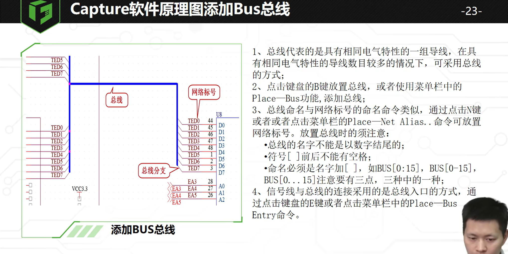

## Capture软件操作界面及常用设置

### 启动软件的更改

在File---change product中，可以更改启动的设置

一般都是使用OrCAD capture CIS，这个的功能比较全

### 系统颜色的更改

Option---perference

在这里可以进行系统颜色的更改

格点设置也是在preference中，有个Grid Display，可以在这里面进行更改，分为两部分，原理图和原理图库的格点

前面的复选框是打印的时候用的

## 自带元件库介绍

存放位置：安装目录--tools--capture--library

具体每个库都是干什么的在ppt中有，需要的时候进行查阅即可

## 创建元器件库

File--New--Library，文件后缀是olb

如果路径不满意，可以Flie--Save as另存为,==不建议放在中文路径下面，会出问题。==

**注意这个创建的是一个库，不是一个元器件**

### 添加元器件

右击新建好的库--New Part

页面的放大缩小快捷键O，I

或者Ctrl+滚轮

放置管脚的时候不用分太细，shape中的Dot表示低电平有效，Order表示旋转的角度

放置管脚可以单个放置也可以阵列放置

阵列放置的可以用负号进行递减

例如上图左边就是递增放置，右边是递减放置

之后进行Editor pins进行统一更改名称,==注意更改的时候默认顺序是比如1-18，36-19，==记得注意看

这里面的Value值是可以进行更改的，因为是芯片，如果是电阻电容等就需要在放置到原理图的时候进行更改

## 元器件库的管理与调用

先随便单击一个器件，之后按R,就会定位到这个地方了

复制粘贴过来后，不知道为什么会出现三个而且删除不掉，这个老师在视频中也没有讲怎么处理的，我试了下发现是先yes，之后no，后面是问你要不要删除整个包。

### 通过原理图获取库

打开原理图里面会有个Design Cache,里面有库文件，直接复制粘贴过去就可以了

双击原理图的元器件可以看到详情，如上图，但是不知道为什么我的点击出来是横的，他的是竖着的

调用原理图库的时候在原理图界面点击place--part--之后点击添加图案就可以了

## 元器件库与PCB封装库关联

一种是在元器件库中右侧属性栏直接在package中填写，或者是在原理图中进行更改，这个是在后续的课程中

## 原理图

### 原理图的新建、添加

新建：File--New--Project，之后出现的框一个是名字，一个是位置

新建工程会自动出现原理图，新建原理图也会自动出现工程，OLB文件可以后续添加

添加库文件就是在左侧的Library中右击Add Files,这个和上面的在右侧place...添加效果是一样的，但是用place-->Part默认位置是官方的那些库

### 添加元器件

dsn文件的名称在软件中是不可以直接重命名的，要么save as,要么就是关掉软件后在文件资源管理器中去重命名。

下一层级的两种是可以重命名的。

更改纸张大小右键相应的原理图，选择Schematic...，之后单位选择mm才能看到A4等，单位是inch貌似纸张大小和mm单位表示不是一样的。

### 放置元器件

Place-->Part-->添加元器件库（不添加也可以）-->之后右侧上面双击想放置的元器件即可，这个放置之后是立即进行编号的（单击器件之后再按键盘就可以快速跳转到首字母为这个的器件，好像是单机下就可以了，忘记了是不是单击之后不松手了）

旋转元器件快捷键R，或者右击元器件-->Rotate

镜像元器件快捷键Edit--Mirror，需要先选中元器件，要不是灰色的，快捷键是H和V。（其实右键就有相关的选项了）

对齐：Edit-->Align-->中心对齐等等

连线快捷键W,放置网络标号需要先用线引出来

和AD不同的是，Orcad的不同页原理图之间网络要用分页符进行连接，用网络标号是连不上的

==搜索快捷键Ctrl+F，需要先点击一下左侧的dsn文件,才能搜索多页原理图==

### 电源和地的联通

> 1.系统自带电源和地连接符的库（CAPSYM），不用添加，直接放置即可
>
> 2.电源和地是全局变量，不同的页面也可以自行连接，不用添加分页符

电源和地如果管脚定义是power了，是不可以放置no connect的

no connect直接删除是删除不了的，需要双击该管脚，之后会弹出来一个界面，将Is no connect前面的勾取消掉就删除了

放置：Place-->power/Gnd，或者点击右侧的小图标也可以

### 原理图添加BUS总线

添加总线作用目前我所知道的就是会看起来网络比较直观，后续画PCB应该也是有点作用的，但是目前我还不知道(同组同层布线，或者有时序要求的时候有用)

> 如何添加BUS总线
>
> 1，place-->BUS(或者快捷键B)
>
> 2，放置完总线后还需要添加名称，Place-->Net Alias
>
> 名称有特定规则，具体参考上图
>
> 3，放置网络标号，需要先添加总线入口，place-->bus Entruy
>
> 如果放置了no connect,需要双击管脚，之后弹出来的表格中取消勾选is no connect即可

### 原理图添加差分属性

​	添加差分信号需要先选中一页原理图，要不相应选项会是灰色的

> 1、鼠标左键单击选中一页原理图，然后执行菜单 
>
> 命令“Tools-Create Differential Pair...”， 
>
> 2、在弹出的Create Differential Pair窗口中查 
>
> 找需要设置的网络名并添加到Selections中； 
>
> 3、在①箭头处输入需要查找的大概网络名； 
>
> 4、在②箭头处选择具体对应的网络名； 
>
> 5、点击③箭头处的符号即可添加到Selections中； 
>
> 6、点击④箭头处的Create即可自动创建好差分类。

这个界面是双击网络得到的，但是不知道为什么总线里的网络无法双击出来，先放在相应网络名下面的线上之后双击即可

### 原理图PCB Footprint处理

一种是类似于芯片，可以在创建原理图库的时候就在右侧把封装名填上去，电阻电容等就是需要原理图建好后双击器件之后在弹出的页面中进行添加；我的想法是可以多建几个不同封装的电阻电容，省的一个个添加的

### 原理图DRC检查工具介绍

 先点击左侧的dsn文件(选择根目录）

PCB-->Design Rules Check

DRC检测文件不能放在中文下面，会报错

运行后会在左侧的output文件下出现一个文件，双击可以打开

报错的地方会出现绿点，如果想要去掉的话可以在上图中的DRC Action中选择清除DRC标记

==相应规则的设置在Rules Setup中==

> 24.1版本无法运行DRC解决办法：[hotfix spb 23.10.001，7天有效 - 第4页 - Cadence Allegro论坛 - EDA365电子论坛网](https://www.eda365.com/forum.php?mod=viewthread&tid=737349&page=4#pid2955909)
>
> OrCAD 23.10.S001补丁 运行不了Design Ruler Check的问题解决了，可以打开软件安装路径下比如C:\Cadence\SPB_23.1\tools\bin，修改orCefSettings.ini文件，添加一行lang=en-US 保存即可，注意关闭软件情况下修改。

> **DRC报错信息：**
>
> u Check single node nets：检查设计中的单端网络； 
>
> u Check no driving source and pin type…：检查器件属性无源管脚与有源管脚的连接是否正确； 
>
> u Check duplicate net name ：检查重复的网络名称； 
>
> u Check off-page connector connect：检测分页图纸间接口的连接性； 
>
> u Check hierarchical port connection：检测阶层端口的连接性； 
>
> u Check unconnected bus net：检测没有连接的总线网络； 
>
> u Check unconnected pins：检查没有连接的管脚； 
>
> u Check power pin visible：检测电源属性的管脚是否显示了管脚名称与编号； 
>
> u Check missing/illegal PCB Footprint：检测封装名称是否填写。是否含有非法字符； 
>
> u Check Normal convert view system：检测一个部件的正常视图上的pin号是否与转换视图上的pin号不同； 
>
> u Check incorrect pin group assignment：检查同一个Pin Group的所有插脚是否有相同的类型； 
>
> u Check high speed props syntax：在设计中检查网络高速属性的语法是否正确； 
>
> u Check missing pin number：检测缺失管脚编号的管脚； 
>
> u Check device with zero pins：：检测设计中是否含有零宽度的管脚； 
>
> u Check power ground short：检测一个Part内部的电源网络名称是否有两个不同的网络标号名称； 
>
> u Check Name Prop consistency：检测层次原理结构中是否含有相同的网络名称； 
>
> u Report all net name：报告所有网络的名称； 
>
> u Report off-grid object：报告不在格点上是器件； 
>
> u Report hierarchical ports and off-page connection：报告阶层端口和分页图纸间接口的连接； 
>
> u Report Misleading Tap Connection：报告易误解的连接。 
>
> u Report Visible unconnected power pins：报告所有具有可见电源属性的管脚是否有连接； 
>
> u Report unused part packages：报告原理图中未使用的器件part； 
>
> u Report invalid Refdes：报告原理图中无效的器件位号； 
>
> u Report identical part references：报告原理图相同的位号。

**==检查单端网络是比较重要的，cadence中多页原理图不同页之间的信号要使用分页符，如果不使用，在两页原理图中它会自动加上后缀==**

