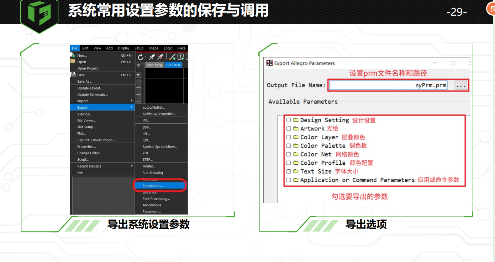

## Part 1 软件系统安装及综合设置

### 1.Orcad常用菜单介绍与推荐设置

## 2.Allegro常用菜单介绍与推荐设置

一般使用Allegro X Designer Layout这个组件，功能比较强大

在菜单栏中有小图标的命令会在下面的快捷命令那一栏显示

当某些窗口不小心取消后，可以在View–>UI Settings–>Reset UI to Default,重置窗口

主要选项是在View—>Windows中勾选，不用重置的

上图为推荐页面设置

## 3.系统常用设置参数的保存与调用 

Orcad的设置不需要每次都更改保存，这点我感觉和AD很像，原理图不需要过多设置，每个工程的原理图设置都是一样的，但是每个PCB都有自己的规则设置

Allegro参数的导出File–>Export–>parameters,然后勾选需要导出的内容，空文件的话是没有那么多选项的

  

视频中的示例网络颜色和应用或命令参数没有勾选，导出后是一个后缀为prm的文件

导入参数：File->Import–>parameters

