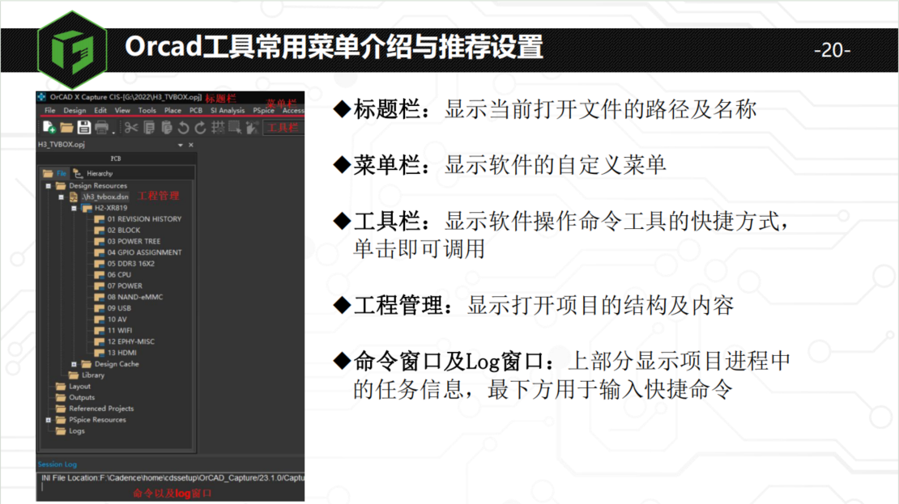
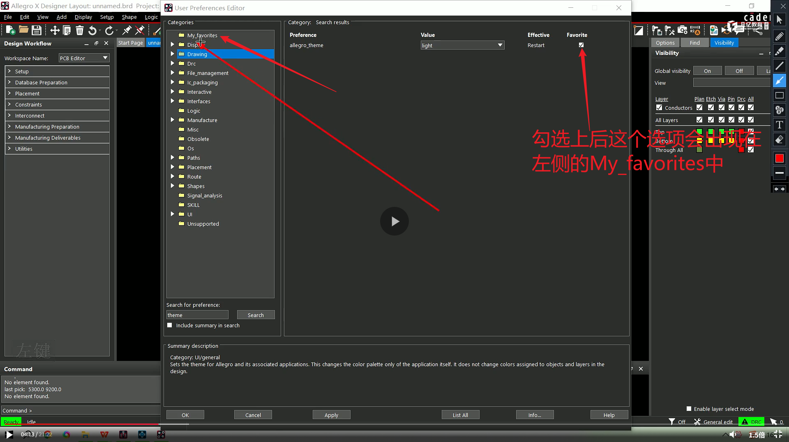
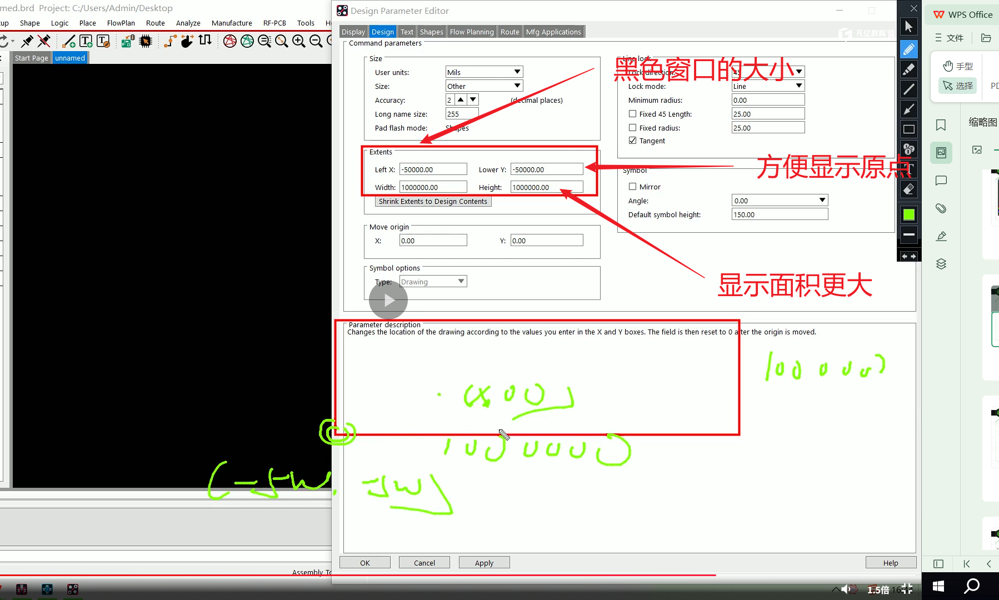

## Part 1 软件系统安装及综合设置

### 1.Orcad常用菜单介绍与推荐设置

## 2.Allegro常用菜单介绍与推荐设置

一般使用Allegro X Designer Layout这个组件，功能比较强大

在菜单栏中有小图标的命令会在下面的快捷命令那一栏显示

当某些窗口不小心取消后，可以在View–>UI Settings–>Reset UI to Default,重置窗口

主要选项是在View—>Windows中勾选，不用重置的

上图为推荐页面设置

## 3.系统常用设置参数的保存与调用

