## Part 1 软件系统安装及综合设置

### 1.Orcad常用菜单介绍与推荐设置

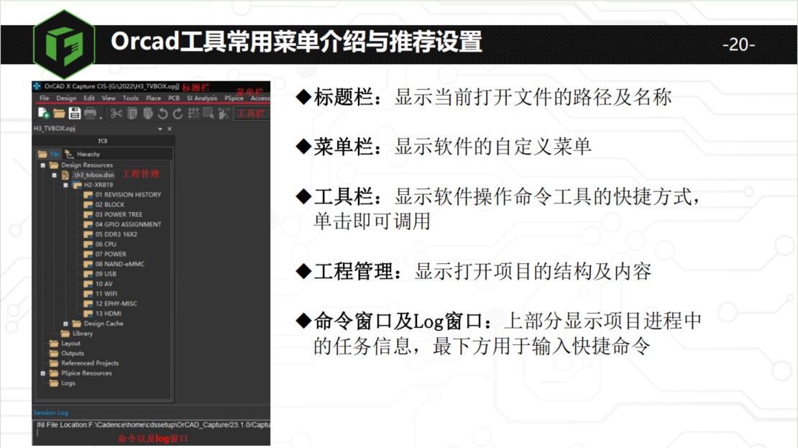

### 2.Allegro常用菜单介绍与推荐设置

一般使用Allegro X Designer Layout这个组件，功能比较强大

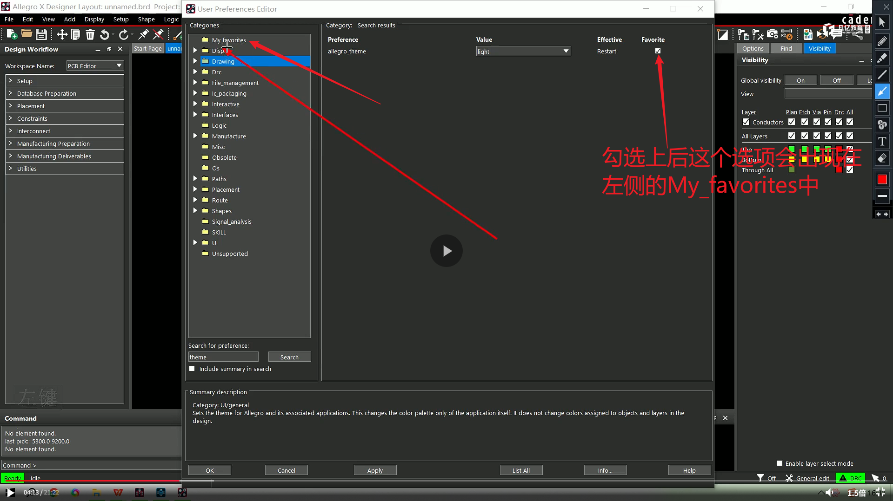

在菜单栏中有小图标的命令会在下面的快捷命令那一栏显示

当某些窗口不小心取消后，可以在View–>UI Settings–>Reset UI to Default,重置窗口

主要选项是在View—>Windows中勾选，不用重置的

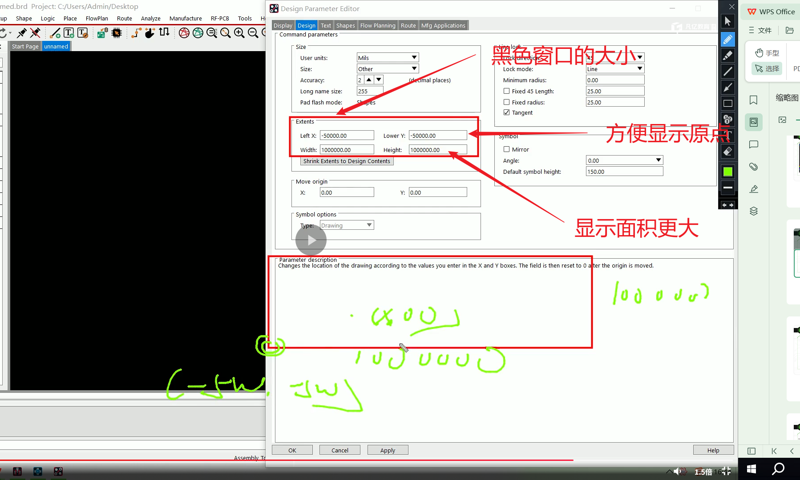

上图为推荐页面设置

### 3.系统常用设置参数的保存与调用 

Orcad的设置不需要每次都更改保存，这点我感觉和AD很像，原理图不需要过多设置，每个工程的原理图设置都是一样的，但是每个PCB都有自己的规则设置

Allegro参数的导出File–>Export–>parameters,然后勾选需要导出的内容，空文件(即打开allegro之后的默认unname的文件)的话是没有那么多选项的

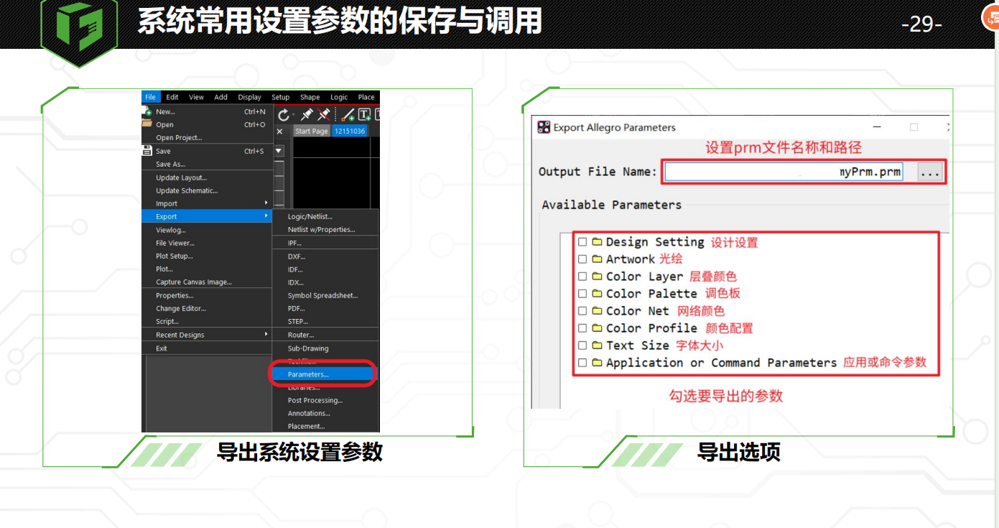

  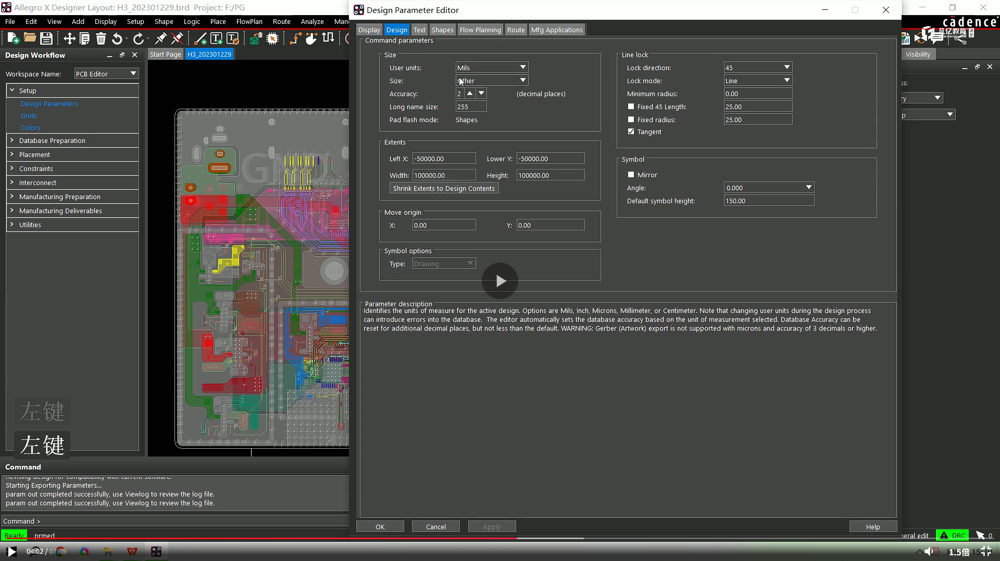

design setting的内容就是如上图所示的

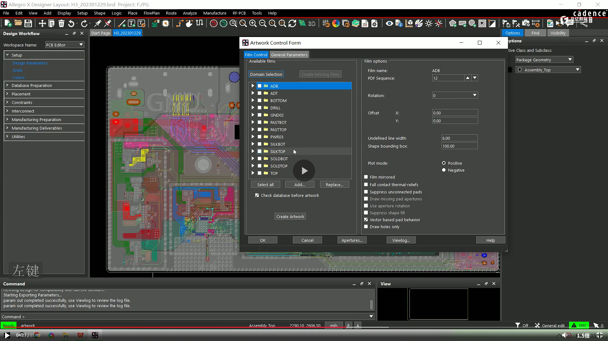

Artwork的内容是Manufacture->Artwork中的内容，是光绘文件，可以复用的

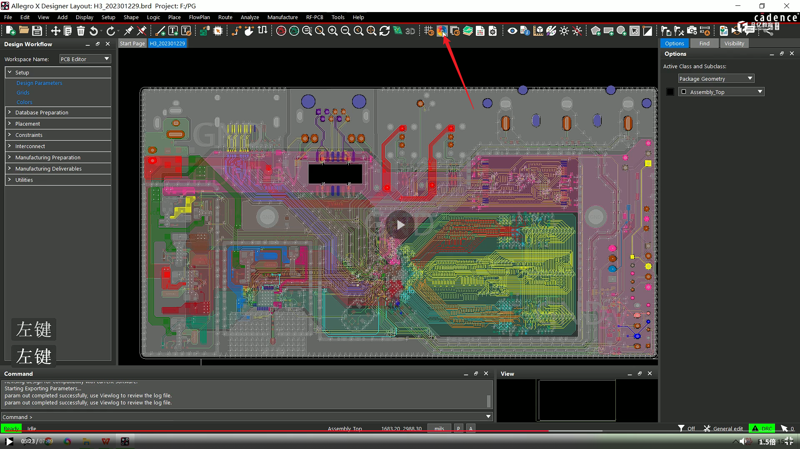

层叠颜色和调色板就是上图箭头所指地方的参数，包括每层的走线铜皮是什么颜色的

字体颜色大小可以导出：Setup->Deesign parameter->Text

视频中的示例网络颜色和应用或命令参数没有勾选，导出后是一个后缀为prm的文件

导入参数：File->Import–>parameters

### 拓展插件skill的设置与安装方法

比较新的版本不支持使用bat文件安装

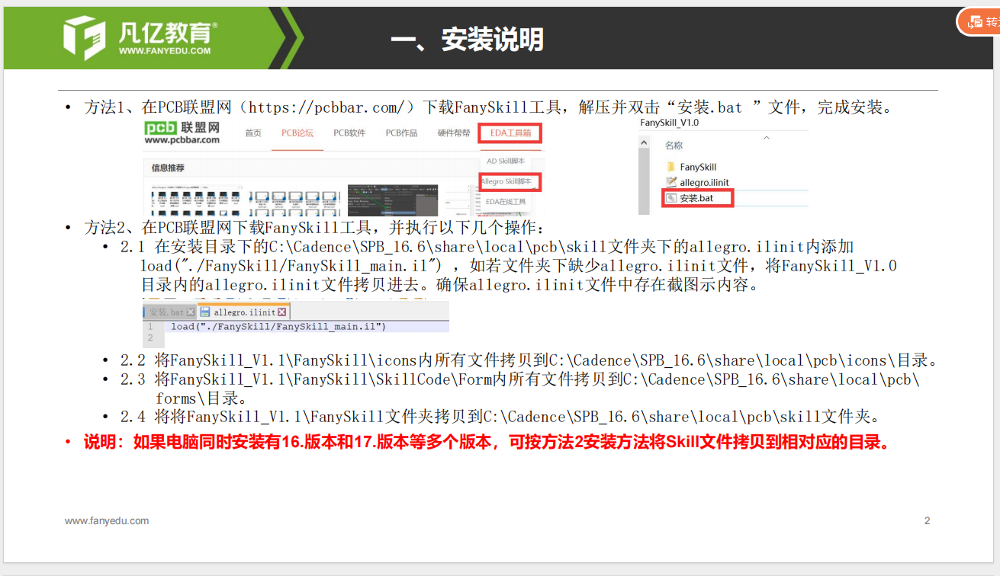

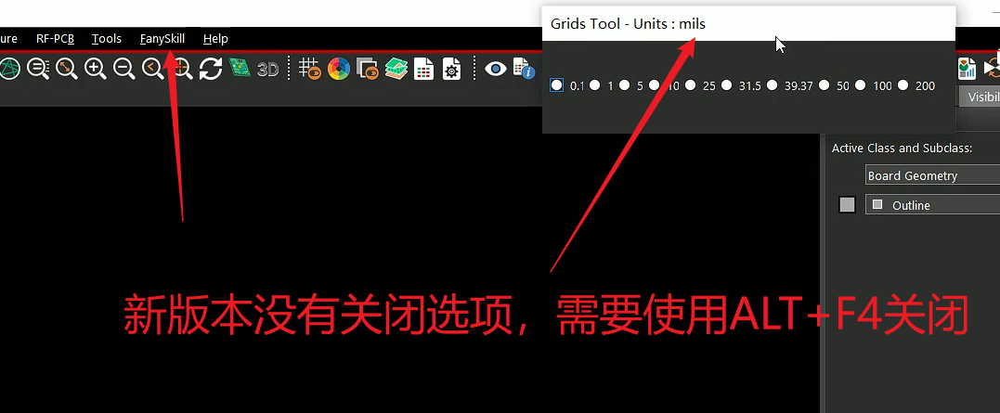

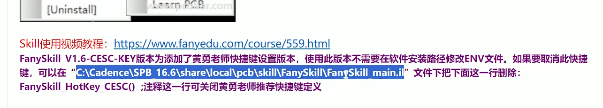

注释符号是英文;

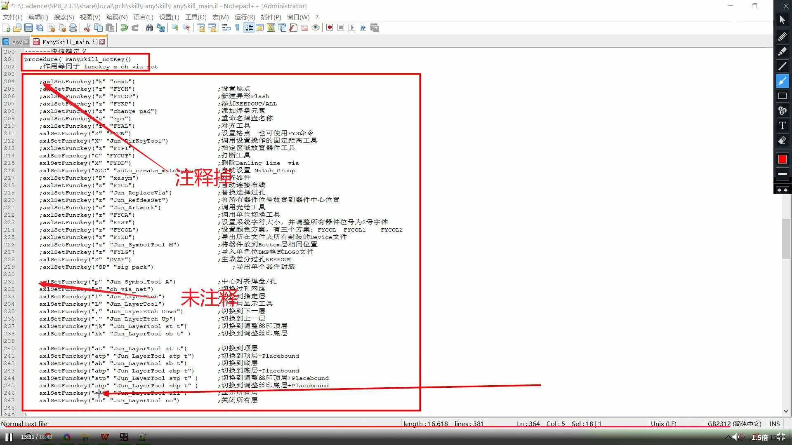

### 各类文件后缀介绍以及文件归档

>  **Orcad文件后缀**
>
> .dsn：原理图文件
> .opj：项目管理文件    这个打开原理图后会自动生成
> .olb：原理图库文件
> .net：网络表文件
> .lib：仿真模型描述库文件
> .log：记录说明文件

> **Allegro文件后缀**
>
> 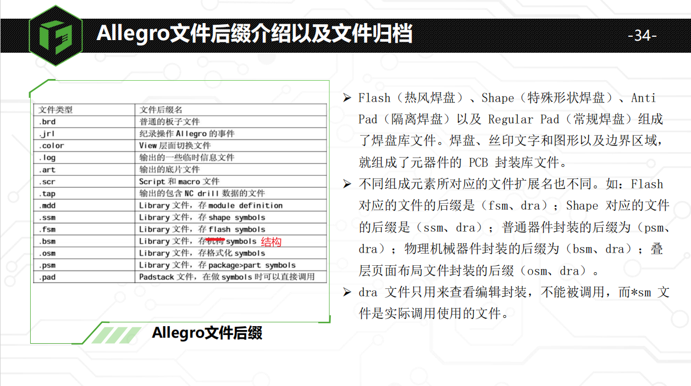
>
> .dra是封装编辑文件，生成的调用文件就像是.fsm这样的文件
>
> 我的理解就是dra是封装创建和编辑使用的，..sm是在allegro被调用的文件
>
> 

### 项目工程为文件创建以及项目文件管理

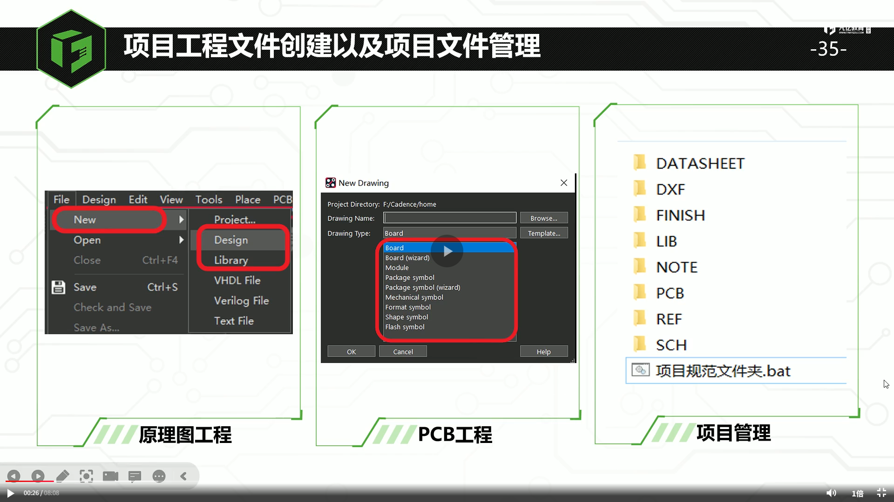

一般都是File–>New–>project,allegro的内容会 多一点（应该是指下图中的TYPE会比orcad多一点）

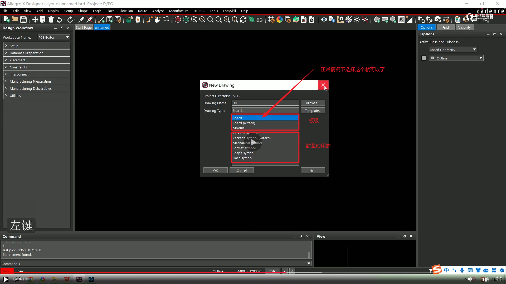

课件资料里面有一个bat文件，双击就可以创建项目规范的那些文件夹

## Part 2 原件库（原理图库）的创建

