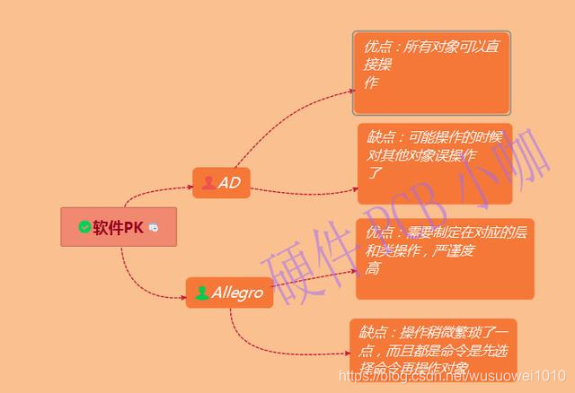
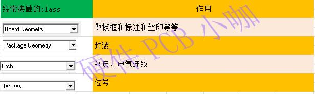
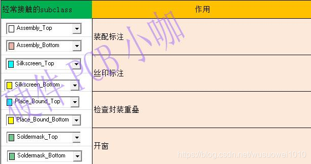
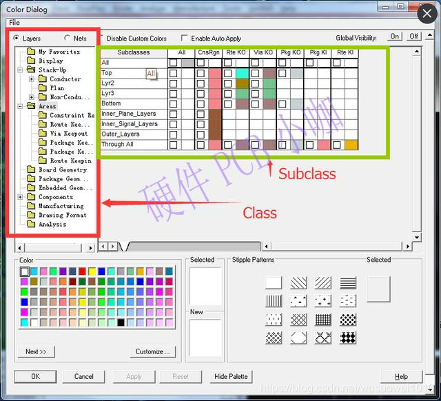
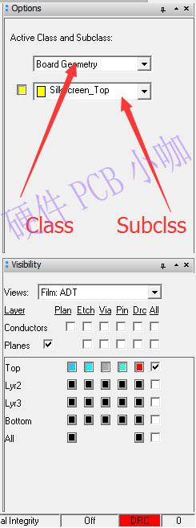
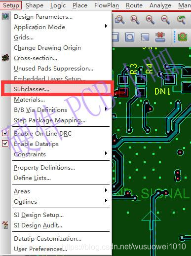
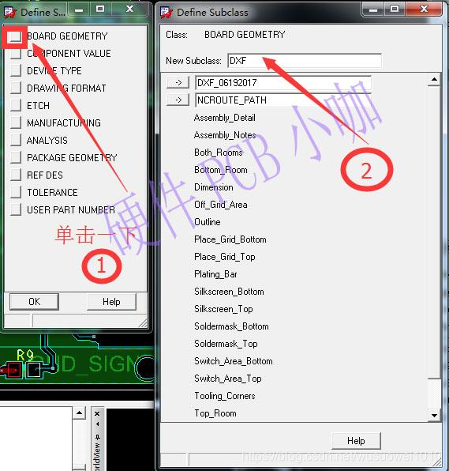
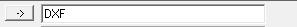

Allegro中的Class和Subclass

**Class 和 Subclass 的定义**

**Class** 是对象的主要类别，例如板框、封装、铜皮等。每个 Class 下可以进一步细分为多个 **Subclass**，用于更精细地管理对象。例如：

- **Board Geometry** 是一个常见的 Class，其中包含 Subclass，如丝印层（Silkscreen_Top）、装配层（Assembly_Top）等。
- **Etch** 是另一个 Class，用于管理电气层，其 Subclass 包括顶层（Top）、底层（Bottom）等。

这种分类方式类似于学校中的年级（Class）和班级（Subclass），每个学生（对象）都归属于某个年级和班级。

Class 和 Subclass 的作用

通过 Class 和 Subclass，可以实现以下功能：

- **对象管理**：将不同类型的对象分组，便于查看和编辑。例如，顶层丝印和底层丝印可以分别归类到不同的 Subclass 中，避免混淆。
- **属性控制**：对不同的 Subclass 设置特定的属性，例如颜色、线宽等。
- **层次化管理**：通过细化分类，便于在复杂设计中快速定位和操作特定对象。

如何查看和操作 Class 和 Subclass

在 Allegro 中，可以通过以下方式查看和操作 Class 和 Subclass：

- **颜色面板**：在颜色设置界面中，可以查看所有的 Class 和其对应的 Subclass。
- **选项面板**：在左侧选项面板中，也可以找到相关的分类信息。
- **添加或删除 Subclass**：通过菜单中的 Subclass 设置，可以为某个 Class 添加新的 Subclass，或删除不需要的 Subclass。

例如，若需要在 **Board Geometry** 中添加一个新的 Subclass（如 DXF 图层），可以通过菜单输入名称并确认添加。

注意事项

- **名称的意义**：Class 和 Subclass 的名称本身没有实际意义，关键在于 Allegro 如何使用这些分类。例如，虽然 **Etch/Top** 通常表示顶层铜箔，但这只是系统默认的约定，用户可以根据需要重新定义。
- **系统管理的 Class**：某些 Class（如 Pin 和 Via）由系统自动管理，用户无法直接修改。

其实Allegro将所有元素都分类的很仔细是方便后期的操作，我觉得建立了Subclass其实就是对每个Class的一个细化，比如在Board Geometry中有丝印层silkscreen_Top,在Package Geometry也有 silkscreen_Top。而在AD中silkscreen_Top就只有一层了，所以假如我选择了对Board Geometry中有丝印层silkscreen_Top的任何编辑都不会影响，Package Geometry的 silkscreen_Top。

换句话说，其实就是allegro把不同元素细化，方便各个对象管理和控制。

《一》初步认识class和Subclass

这里主要讲我们PCB常用的class，以及subclass，其他class和subclass用的不多，在大家熟悉软件做项目多了就加深印象了，后面的叠层设置和项目实战系列加深class和subclas的理解。

刚入门allegro常接触的几个class是下面板框、封装、铜皮、位号这几个大类

常见的Class

常用的subclass是顶层丝印、底层丝印、装配层、placebound、顶层开窗、底层开窗、顶层paste、底层paste层。

常用的Subclass

《二》查看class和Subclass

（1）在颜色面板可以看查看Class和Subclas

（2）在左边的选项面板中可以查看

《三》添加和删除subclass

在上一节添加DXF的时候我们可以添加对应的层，但是我们不可能每次都要无缘无故找个DXF来添加subclass，那样太麻烦了。

比如我需要添加一个DXF的图层，我计划添加在Board Geomtry里面的添加一个DXF subcalss，方法如下：

(1)Stup菜单中选择Suclass

(2)进入菜单后，找到我们需要加的Board Geomtry，然后在右侧的弹出的菜单输入DXF，按Enter即可。

Subclass添加界面

（3）如果需要删除subcalss，前提是确保您的PCB上没有调用任何该subclass的元素，否则删除会失败，但是系统会提示您它的位置。如刚刚我们添加的DXF需要删除就点击左侧 -> 的这个按键这里就可以删除了

DXF删除界面

**Geometry**

**Board Geometry**

在板子上的图形，在板子上添加的标识、说明、注释等信息应添加到该类的子类上。

- Assembly-Det[ai](https://www.elecfans.com/tags/ai/)l和Assembly-No[te](https://www.elecfans.com/tags/te/)的使用与装配有关.Assembly_Detail用于指示装配细节，比如器件在PCB上进行固定的规程等.Assembly_Note可以标注装配的注意事项.
- Both_Rooms，Bottom-Room，Top-Room，Pl[ac](https://www.hqchip.com/app/1703)e-Grid-Bottom，Place-Grid-Top与自动布局有关，具体可以参见自动零件摆放的说明。
- Silkscreen-Bottom和Silkscreen-Top分别为Bottom层和Top层丝印，某些情况下比如需要在PCB板标注某个[电位器](https://www.hqchip.com/app/1261)的含义，以方便调试或操作时，可以此层添加对应图形
- Constraint-Area用于在设计中指定特殊的布线区，在这些布线区中可以设定特殊的布线规则
- Dimension用于标注设计中的有关尺寸.
- Off Grid_Area用于指示设计中不使用栅格的区域。
- Outline用于绘制PCB的外形（板框）.
- Plating-Bar用于指示设计中需要电镀的地方，比如很多采用金手指的设计中可以用Plating-Bar来指示需要镀金的金手指条
- Soldermask_Bottom和Slodermask_Top用于设计在Bottom层和Top层添加阻焊窗，即添加不需要俗称绿油的区域.
- Switch_Area Bottom和Switch_Area-Top用于指示可以将区域内零件的摆放进行交换的区域。
- Tooling-Corne[rs](https://www.elecfans.com/tags/rs/)用于指示某些需要加工的转角等。例如在某些设计中，在PCB的外形中有拐内角的地方，虽然设计中是一个直角，但加工完成后则是一个圆弧角。如果设计中没有考虑这个尺寸余量将导致零件无法装配.‍

**Package Geometry**

在焊盘图形中的图形，在焊盘图形中添加的标识、说明、注释等信息应添加到该类的子类上。

- ASSEMBLY-TOP和ASSEMBLY-BOTTOM是与装配相关的内容，表示的是零件的外形和方向。
- PLACE-BOUND-TOP和PLACE-BOUND-BOTTOM表示的是零件在Top层和Bottom层各自占位大小，在同一层中如果两个零件的PLACE，BOUND区域有交叠将发生DRC错误。
- [PI](https://www.elecfans.com/tags/pi/)N-NUMBER用于表示零件的引脚号的显示。

**Manufacturing**

- PHOTOPLOT-OUTLINE用于指示在生成Gerber文件时的指定区域，区域外的将不做输出
- NO_GLOSS_ALL，NO_GLOSS_BOTTOM，NO_GLOSS_TOP，NO_GLOSS INTERNAL.分别用于指示所有层、Bottom层、Top层、内层（非Bottom层和Top层）禁止使用GLOSS功能.
- NCDRILLFIGURE用于指示设计中钻孔（包括通孔，盲孔和埋孔）。对于不同规格的钻孔NCDRILL-FIGURE用不同的符号标识.NCDRIL-LEGEND用于统计NCDRIL FIGURE标识的各种规格钻孔的Class型与数量.NCDRILL_FIGURE和NCDRIL LEGEND相结合可以指导钻孔的加工.
- AUTOSILKTOP和AUTOSILK BOTTOM指的是在Allegro中通过Auto Silkscreen命令生成的丝印
- NO-PROBE-TOP和NO-PROBE-BOTTOM，以及PROBE-TOP，PROBE-BOTTOM分别为Top层，Bottom层禁止飞针测试区和Top层，Bottom层飞针测试区.

**Drawing Format**

用于在设计中添加技术说明，以告诉制版厂其他的一些加工信息，如叠层结构、板厚的容差等

**Stack-Up**

DRC：设计中的错误报告显示

ETCH：导体蚀刻层，与设计层数相关，代表PCB各层的导体图形

An[ti](https://www.elecfans.com/tags/ti/)-ETCH：与ETCH相对，与设计层数相关，当使用split plane create命令时，如果此层有图形，则生成的Shape将避开对应的图形，常用作Plane层面的分割

Pin：焊盘图形中的引脚相关内容

Via：PCB和焊盘图形中通孔的内容

**Components**

Refdes：[元器件](https://www.hqchip.com/ic/0)显示字符，对应到原理图对元器件定义的位号属性

ComponentValue：

Device Type

Tolerance

User PartNumber

**Areas**

Route Keepin：允许布线区

Route Keepout：禁止布线区

Via Keepout：禁止放置Via区

Package Keepin：允许布局区

Package Keepout：禁止布局区

1.STACK-UP(层叠)
1.Pin：焊盘图形中的引脚相关内容
2.Via：PCB和焊盘图形中通孔的内容
3.ETCH：导体蚀刻层，与设计层数相关，代表PCB各层的导体图形
4.DRC：设计中的错误报告显示
5.Anti-ETCH：与ETCH相对，与设计层数相关，常用作层面的分割
6.Boundary:边界，基本上没有图形

2. Areas（区域）
1.Route Keepin：允许布线区（经常用于outline内缩10mil，用来限制布线区域）
2.Route Keepout：禁止布线区（经常用于PCB封装时电感下方的区域内，不能布线）
3.Via Keepout：禁止放置Via区
4.Package Keepin：允许布局区
5.Package Keepout：禁止布局区（一些特殊要求的场合）

3. Geometry（几何图形）
电路板上的图形，注释，标记等内容放置层。

Board Geometry
1.Silkscreen-Bottom和Silkscreen-Top分别为Bottom层和Top层丝印，我习惯是在后期的丝印添加在此层
2.Design_Outline用于绘制PCB的外形（板框）
3.Soldermask_Bottom和Slodermask_Top用于设计在Bottom层和Top层添加阻焊窗，即添加不需要俗称绿油的区域。（可以手工添加阻焊层，有一定的自由度）

Package Geometry
1.ASSEMBLY-TOP和ASSEMBLY-BOTTOM是与装配相关的内容，表示的是零件的外形和方向。
2.PLACE-BOUND-TOP和PLACE-BOUND-BOTTOM表示的是零件在Top层和Bottom层各自占位大小，在同一层中如果两个零件的PLACE，BOUND区域有交叠将发生DRC错误。在3D显示时如果没有提交step文件，那么就会显示此地方的高度值。
3.PIN-NUMBER用于表示零件的引脚号的显示。
4.Soldermask_Bottom和Slodermask_Top用于设计在Bottom层和Top层添加阻焊窗，这个时在设计PCB焊盘封装时添加的，负片的，有图形的地方没有绿油。
5.Pastemask_Bottom和Pastemask_Top用于设计在Bottom层和Top层添加助焊窗，这个时在设计PCB焊盘封装时添加的，用于开钢网，这个是负片的，有图形的地方是需要开空的。
6.body_center，这个是封装的中心位置。
7.Silkscreen-Bottom和Silkscreen-Top分别为Bottom层和Top层丝印，对应封装。

4. Components（组件）
Refdes：元器件显示字符，对应到原理图对元器件定义的位号属性，里面包含了，装配的位号，和部件的位号。

5. Manufacturing（加工制造）
1.PHOTOPLOT-OUTLINE用于指示在生成Gerber文件时的指定区域，区域外的将不做输出
2.NCDRILLFIGURE用于指示设计中钻孔
3.Nclegend-1-6,这个时生成钻孔表时其所在的层。

