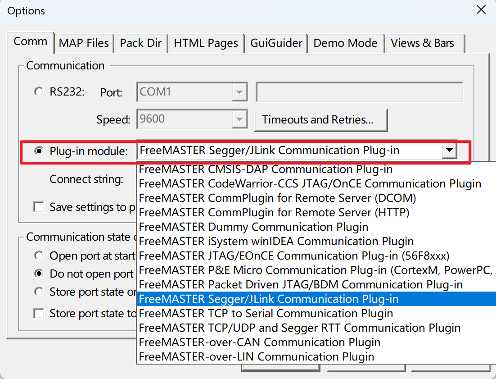

## 安装

### plug-in module会出现空白

如果不安装在C盘，在Project-->Options中的plug-in module会出现空白，如下图

****

安装过程与运行具有管理员权限的“c:\NXP\FreeMASTER 3.0\FreeMASTER\register.bat”相同。如果重新安装没有帮助，在cmd控制台窗口(以管理员身份启动)手动运行该文件即可。

推荐首先试试运行下这个bat文件

原文链接：[FreeMaster 中 Plug-in Module 显示空白的问题_freemaster plug-in module-CSDN博客](https://blog.csdn.net/weixin_43086497/article/details/109120673)

[FreeMaster的Plug-in module没有任何显示 - Kinetis - 恩智浦技术社区](https://www.nxpic.org.cn/module/forum/thread-620761-1-1.html)

### 界面显示会有一部分字被遮挡住

界面显示在波形的参数设置中有部分显示不全

> **第一步：**
>
> 在桌面软件快捷方式的图标上按鼠标右键，在弹出的对话框中选择【**属性】，**进入到属性界面，并在属性界面选择【**兼容性】，**然后在兼容性下点击【**更改[高DPI设置](https://zhida.zhihu.com/search?content_id=173363924&content_type=Article&match_order=1&q=高DPI设置&zhida_source=entity)】。**
>
> **第二步：**
>
> 在新弹出的对话框中**勾选 【替代高DPI缩放行为。】，**然后点开下拉框，在【**缩放执行**】中选择【**系统(增强)】，**然后点击【**确定】**
>
> **第三步：**
>
> 在弹出来的对话框中依次点击【**应用**】，【**确定**】------**大功告成！**
>
> Tips：第二步，勾选上方程序DPI下的使用此设置修复程序缩放问题，下面的高DPI缩放替代改成应用程序，再打开软件就不糊了。
>
> 程序DPI下面都写了如果显示器DPI发生改变，程序可能变糊，win可以根据显示器设置的DPI修复程序缩放问题，当然要勾了。

原文链接：[屏幕分辩率太高了,软件不适配，1分钟解决！ - 知乎](https://zhuanlan.zhihu.com/p/383550910#:~:text=本文的重点来了，只需要1分钟就可以解决高分辩率屏部分软件不正常显示的问题！ 喜欢的网友给个赞！ 在桌面软件快捷方式的图标上按鼠标右键，在弹出的对话框中选择【属性】， 进入到属性界面，并在属性界面选择【兼容性】， 然后在兼容性下点击【更改 高DPI设置】。,在新弹出的对话框中 勾选 【替代高DPI缩放行为。 】， 然后点开下拉框，在【缩放执行】中选择【系统 (增强)】， 然后点击【确定】)

### 重装软件后plug-in module只有俩选项

在控制面板中点卸载，之后出现的页面中有个修复选项，选这个即可

## 使用

图一需要注意的是调试需要点GO才行，更多的功能后面再摸索

图二是可以更改字体颜色等

图三中的Help中可以看到User manul

在1602的Demo中，这些都类似于表格，可以更改颜色字体等，可以全部框选中之后进行字体颜色的更改，在Value中貌似可以填值进去，但是我还没有试过

在示例中，上述的Variable Watch没有添加该变量，但是在波形窗口可以添加，在我尝试后

是在此处新建一个，但是命名为这个名字而已

在波形图的参数选项中，这个周期有时候需要调整下

