## 一、原理图

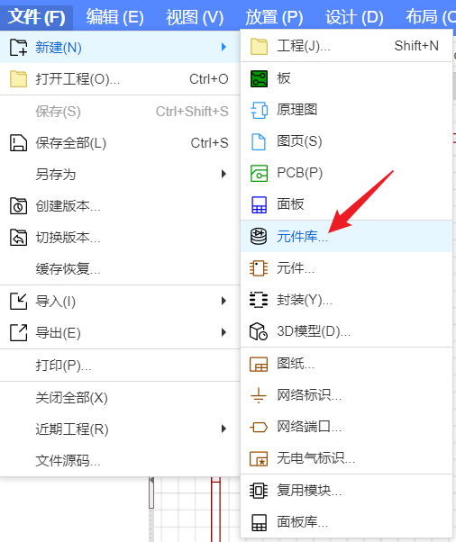

栅格尺寸设置一致

栅格尺寸是一次移动的距离，和网格尺寸设置一致

画丝印的时候可以用过孔辅助画线定位

视频中开始画电阻电容的时候找的是封装尺寸，后面芯片之类的看的是数据手册，实际器件的尺寸，我感觉就是焊盘中心对器件中心之后再外扩一点

原理图也要检查DRC

==在绘制板框的时候，快捷键Q可以在mm和mil两种单位之间切换。==

# 二、PCB

模块化布局，一个模块中的元器件放在一起。

交互式布局：在原理图中选中的时候，在pcb中的相应元器件也会被选中。

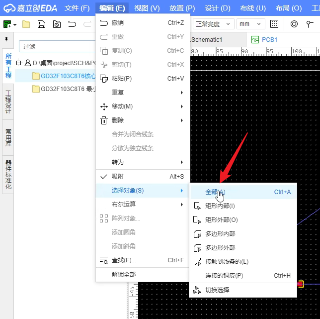

丝印可能会影响焊盘的放置，先选择中一个丝印，然后右击查找，选择全部，就可以选择中全部的丝印。

在布局中的属性位置，选择属性位置中间，可以把丝印都放到器件封装中间，这一步可能需要上一步选中全部丝印。

然后在右侧属性中把字号改小，不让丝印影响布局操作。

板框确定之后可以锁定。

**快捷键ctrl+r可以隐藏飞线，但在移动的时候会显示出来，比直接隐藏飞线层要好一点**

在放置中可以更改焊盘原点，移动时候的原点就会在中心了。

更改完封装后需要在封装管理器中重新关联一下。

在对齐的时候**选择焊盘**。

几个并联电容，放置的时候应该**先大后小**（按照电流流动的方向）

在精细布局的时候，可以在右侧的过滤中把文件属性取消勾选，这样就不会选上丝印了。

在放置晶振的时候，保护电阻要放在靠近芯片的位置，电容放在晶振和电阻中间。

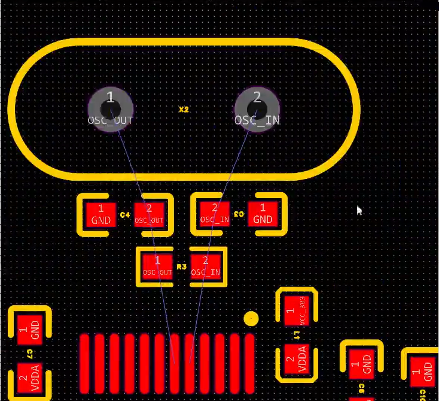

## 设计规则

在布线之前完成。

设计->设计规则->安全间距

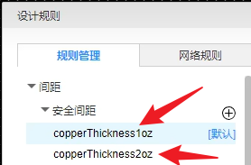

他俩代表着导线厚度，一般第一个就可以，建议把间距都改成8mil，小了会增加成本。

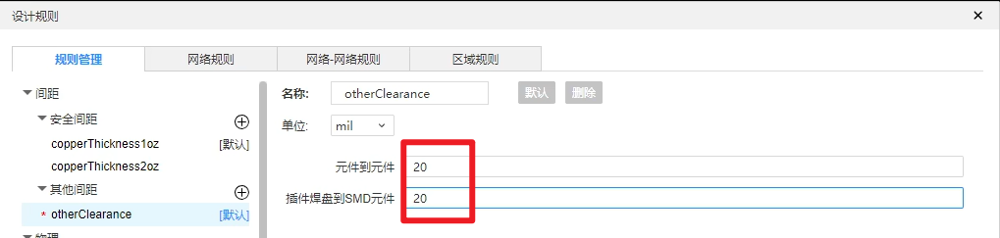

**有黄色的小叉就是报错了**

在导线的设计规则中，建议增加一个电源的，然后在设计->网络类管理器中新增类，之后再设计规则中的网络规则中会出现新的一个网络规则，需要自己把规则改成power。

**差分对管理器**

新增一个，之后再在设计规则中更改一下，差分走线需要线长一致。不是高速板，不太需要计算阻抗。

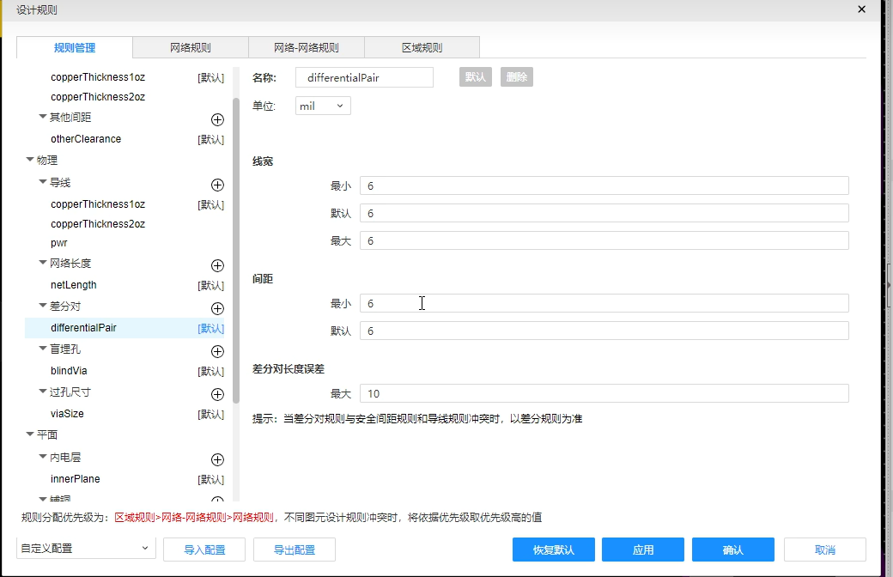

过孔规则，铜皮过流能力需要和过孔过流能力匹配。

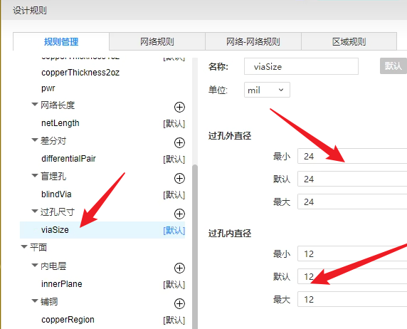

**==上面的数据自定义，参考一点点就可以，不太对。==**

## 布线

布线一般先从复杂的地方开始，也就是线比较多的地方

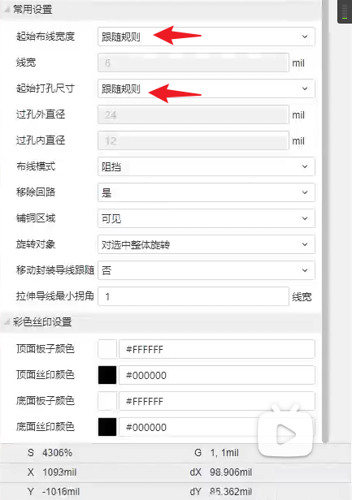

起始布线宽度和起始打孔尺寸都选跟随规则。

快捷键shift+s可以换层显示（切换图层亮度），方便布线。

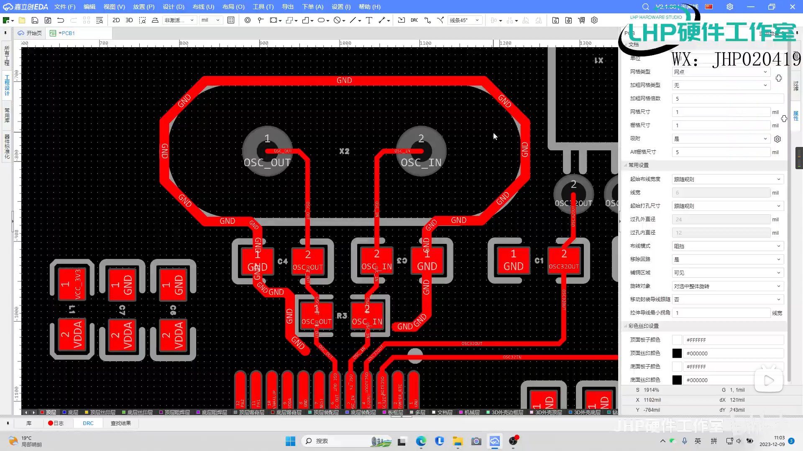

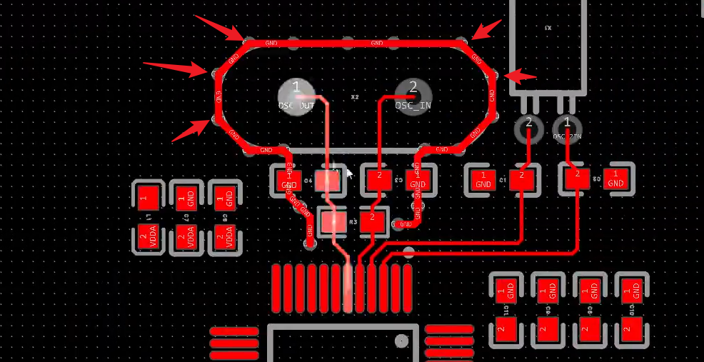

晶振需要进行包地，还有禁止铺铜，包地线宽一般是走线的两倍，用GND包起来

ctrl+鼠标左击可以快速更改相应的快捷键。

另外包地完成后还需要在线上面放置一些过孔。

电流最终都会回到GND，所以最后**底层和顶层会铺铜**，顶层==GND可以在线上打过孔==。

铺铜手工焊接选择十字连接，机器焊接选择全连接。

铺铜可以隐藏。

差分对走线长度要一致。

高亮显示网络很有用。

顶层和底层通过过孔连接时可以是90°，不影响。

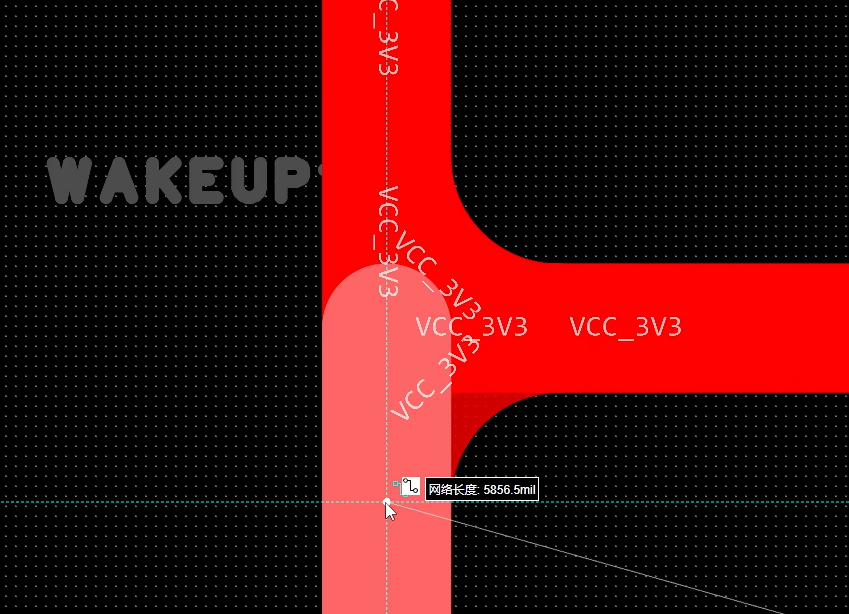

类似这种需要圆弧处理一下，就是一条线连接到另一条走线。

还有好像有些铺铜需要打一些过孔。

## 增加泪滴

### 先增加泪滴再铺铜

工具->泪滴

​	

## 禁止铺铜处理

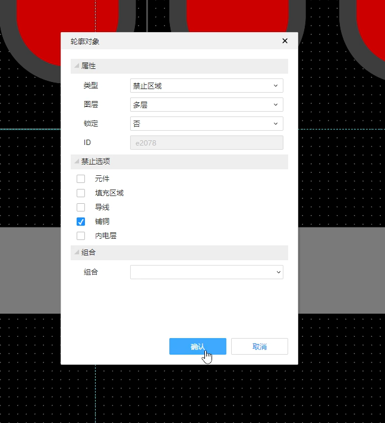

铺铜设计规则 快捷键shift+M隐藏铺铜。

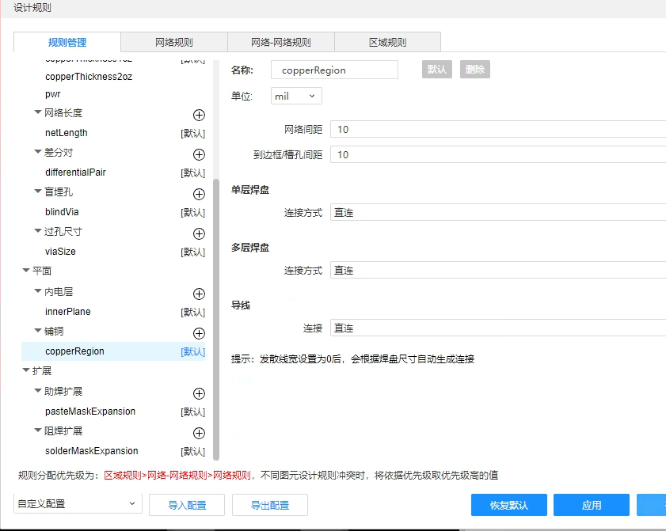

