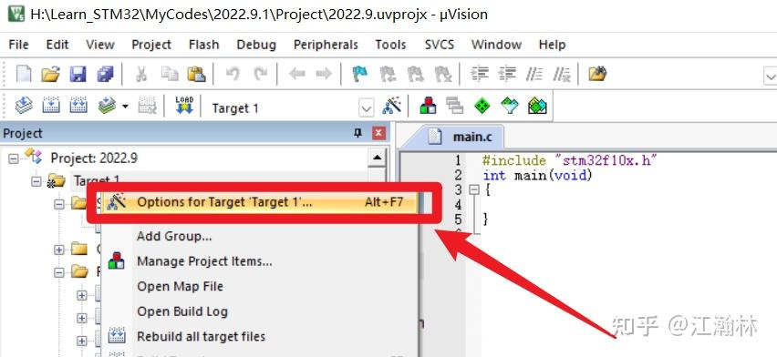
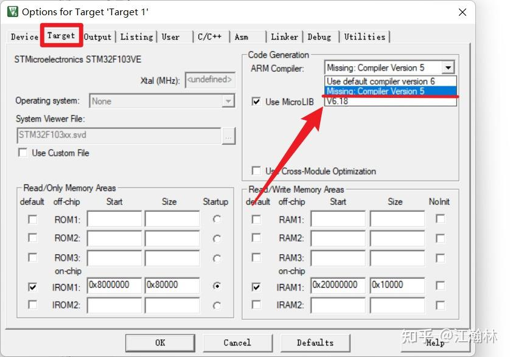
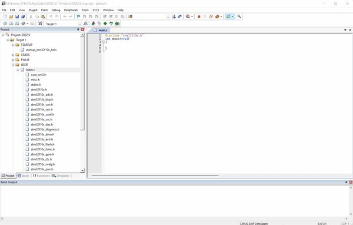
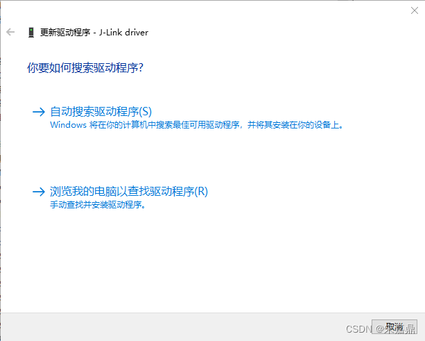
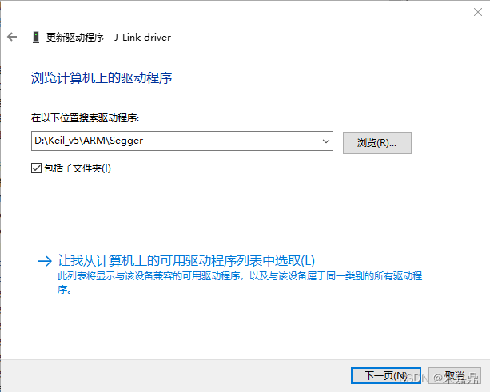
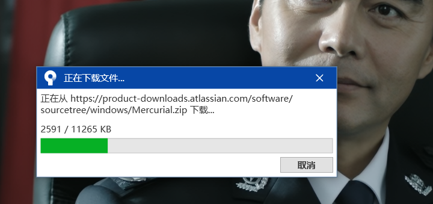

## 安装Jre

安装时显示脚本错误，经过多次尝试，下载了8u281版本，并且断网安装之后成功。

## Keil MDK高版本不再预装ARM Compiler Version5
解决办法：https://zhuanlan.zhihu.com/p/561047339

目前这个办法比较简洁高效，还有其他的方式但是没有这个方便。

主要就是复制一个安装ACC文件，然后再复制到Arm的文件夹中，再添加一下

以下是正文：

### 1、Keil MDK5.37不再预装ARM Compiler Version5

**Keil MDK5.37预装的是最新的ARM Compiler Version6**

先右击查看工程属性



在Target标签下，可以看到**Compiler Version5**就是丢失的



### 2、以[固件库](https://zhida.zhihu.com/search?content_id=212809851&content_type=Article&match_order=1&q=固件库&zhida_source=entity)方式编程，编译之后全是错误

我是按照【[野火](https://zhida.zhihu.com/search?content_id=212809851&content_type=Article&match_order=1&q=野火&zhida_source=entity)】的单片机教程一步一步从最基础开始学习的。刚开始用**寄存器方式**编程的时候使用**Compiler Version6**进行编译没有任何问题。但是一旦使用ST官方的固件库，一编译就提示由344多个错误，如下图所示：




我在网上搜索了产生这个编译错误的原因，原来学习STM32都会买[开发板](https://zhida.zhihu.com/search?content_id=212809851&content_type=Article&match_order=1&q=开发板&zhida_source=entity)，不管是野火，正点还是普中，给的资料例程都是好几年前，在keil5.37编译出错，因为没有[compiler version5](https://zhida.zhihu.com/search?content_id=212809851&content_type=Article&match_order=1&q=compiler+version5&zhida_source=entity)。

### 3、解决问题历程

#### **遇到问题之初**

起先我自己想了一下，既然我的**Keil MDK**安装的是最新版，那我把STM32的固件库也更新到最新版不就行了么！？软件和固件库都是最新的这总没问题了吧！？（事实证明我还是太天真了）于是我迅速进入ST官网下载了最新的STM32F10x[固件库Rev](https://zhida.zhihu.com/search?content_id=212809851&content_type=Article&match_order=1&q=固件库Rev&zhida_source=entity)3.6.0

【[https://www.st.com/content/st_com/en/products/embedded-software/mcu-mpu-embedded-software/stm32-embedded-software/stm32-standard-peripheral-libraries/stsw-stm32054.html](https://link.zhihu.com/?target=https%3A//www.st.com/content/st_com/en/products/embedded-software/mcu-mpu-embedded-software/stm32-embedded-software/stm32-standard-peripheral-libraries/stsw-stm32054.html)】


野火使用的是Rev3.5.0的固件[库文件](https://zhida.zhihu.com/search?content_id=212809851&content_type=Article&match_order=1&q=库文件&zhida_source=entity)，我将Rev3.6.0里的固件库文件替换掉野火教程里老的文件，一点击编译，还是一大堆错误，看来我的思路错了，捣鼓环境什么的最头疼了。

这就是使用新版本软件的代价。经过一番网上冲浪以后，我又找到了解决办法

#### **被ARM官方耍（无法单独下载compiler version5离线包）**

在CSDN刨屎的过程中，前人留下的文章说明ARM有提供**compiler version5**的离线安装包

ARM官网，启动！！！【[https://developer.arm.com/downloads](https://link.zhihu.com/?target=https%3A//developer.arm.com/downloads)】，但是官网已取消支持

#### **问题真正解决阶段**

既然MDK5.37之前的版本有Arm Compiler 5，那就在不同盘安装一个MDK5.36，将MDK5.36[根目录](https://zhida.zhihu.com/search?content_id=212809851&content_type=Article&match_order=1&q=根目录&zhida_source=entity)下的Arm Compiler 5复制给MDK5.37实现双Compiler版本

这里提供一个快速下载ARM家软件的国内网站【[米尔科技](https://zhida.zhihu.com/search?content_id=212809851&content_type=Article&match_order=1&q=米尔科技&zhida_source=entity)】，算是代理商。

【[http://www.myir-tech.com/download.asp?anclassid=71](https://link.zhihu.com/?target=http%3A//www.myir-tech.com/download.asp%3Fanclassid%3D71)】


MDK5.36安装完成后，进入MDK5.36的根目录，复制一个叫【ARMCC】的文件夹，粘贴到MDK5.37的Keil_v5\ARM目录下即可


之后我们打开MDK5.37，点击**Manage Project Items**


在Folders/Extensions标签下，点击右侧省略号添加之前复制的ARMCC文件夹，这样子MDK5.37就有Arm Compiler 5了


### **4、编译终于正常通过**

在工程选项中切换编译工具为**Arm Compiler 5**

**点击编译，顺利通过0 Errors，0 warnings！**


链接：[pan.baidu.com/s/1rPaXDo](http://link.zhihu.com/?target=https%3A//pan.baidu.com/s/1rPaXDolIOwexq1Ry8h4dvg%3Fpwd%3D1111)

提取码：1111

## Keil导入纳芯微的pack失败

在导入纳芯微的1610pack的时候，使用Pack Installer一直失败，版本mdk541

在使用以前的电脑的时候可以安装成功，版本52x,认为是版本过高导致安装失败，下面是相应的解决办法及其链接

[keil5支持包无法正常导入的解决办法_keil pack包安装出现输入路径无效-CSDN博客](https://blog.csdn.net/qq_75055003/article/details/141754500)

> 1，把pack文件后缀名改成zip
>
> 2，解压到一个文件夹中
>
> 3，用Keil的Pack Installer进行安装，file-Import from Folder


还有另一种类似方法就是解压到一个文件夹中后手动放置到Keil的相应Pack文件夹中去

[解决Win11安装Keil芯片包失败/软件卡死/无法解压的问题_errors returned from cpackget-CSDN博客](https://blog.csdn.net/weixin_42518229/article/details/122477885)

## 链接JLink之后，总是提示版本过低，要升级


可能的解决办法，我没试过，本次的故障不知道为啥自己好了

1：升级Keil自带的J-link程序:
2：使用之前版本keil自带的J-link驱动替换掉现在的,也就是将..\Keil\ARM\Segger[文件夹](https://zhidao.baidu.com/search?word=文件夹&fr=iknow_pc_qb_highlight)替换为老版本的,这样里面的J-Link驱动也是老版本的,就不会提示J-Link更新了
3：卸载segger，下载了比较新的驱动重新安装，并将segger/jlinkarm_v440目录下的jlinkarm.dll拷贝到keil/arm/segger的目录下。再次使用MDK，提示升级，确定升级，但这次升级后，jlink确实可以识别。

### 更新

再次出现问题后，得出解决办法


找到这个Updater程序，进行更新

但是可能需要稍等一会，之后就可以了

## Keil中有些地方申明.h头文件的会有红叉报错，但是编译不会报错


原因：代码路径有中文

解决办法：换成英文路径

但是目前我还没有尝试过，效果未知

## Git安装问题

首先是.gitconfig文件的放置位置，可能是我之前安装Cadence的时候工作目录被我更改了，改成了D:\Cadence_data，导致该文件会放置在这里面，他还会导致环境变量中的HOME变量变成这个位置，更改环境变量中的HOME变量位置即可，但是目前我把位置变了，后面不知道Cadence会不会出问题，更改日期2024/12/4晚上，有可能到了5号了。

Win11环境变量的位置：设置-系统-系统信息-高级系统设置

## Cadence安装问题

严格跟着教程走，在更改安装路径的时候只需要更改第一个，第二个工作目录不需要更改，更改了之后会比较麻烦，会把环境变量中的HOME变量更改为这个位置，目前不知道有没有问题。

目前HOME变量位置是在C:\user\yinqi中

另外我把D盘中的candence_data改成了cadence_data,去掉了一个c，不知道有没有影响，后面学习cadence时再说吧，不行就重装。

貌似没有影响。

## Git使用

对于我来说有两种方式

一种就是先在本地创建一个仓库，git init 初始化，之后和远程仓库关联


另一种就是直接clone下来，自己就会和远程仓库关联了

一个公钥好像是可以用于几个不同的网站的

> Git 全局设置:
>
> ```
> git config --global user.name "yog0"
> git config --global user.email "15228820+yog0@user.noreply.gitee.com"
> ```

> 创建 git 仓库:
>
> ```
> mkdir gitee
> cd gitee
> git init 
> touch README.md
> git add README.md
> git commit -m "first commit"
> git remote add origin git@gitee.com:yog0/gitee.git
> git push -u origin "master"
> ```
>
> 如果是github的话需要把master改成main,再github中还有一行命令`git branch -m main`指定当前分支为main
>
> 

> 已有仓库?
>
> ```
> cd existing_git_repo
> git remote add origin git@gitee.com:yog0/gitee.git
> git push -u origin "master"
> ```

gitee我是比较推荐clone下来再用，不要关联，这个网站有点不好用

github都可以的

后面我又生成了一个密钥，并且在.ssh文件夹中添加了config文件

> 内容如下
>
> ```
> # gitee
> Host gitee.com
> HostName gitee.com
> PreferredAuthentications publickey
> IdentityFile ~/.ssh/gitee_id_rsa
> # github
> Host github.com
> HostName github.com
> PreferredAuthentications publickey
> IdentityFile ~/.ssh/github_id_rsa
> ```
>
> 这里注意最后一行用的是私钥，不是公钥
>
> Github初始仓库:
>
> **…or create a new repository on the command line**
>
> ```
> echo "# notebook" >> README.md
> git init
> git add README.md
> git commit -m "first commit"
> git branch -M main
> git remote add origin git@github.com:Yogogogogo/notebook.git
> git push -u origin main
> ```
>
> **…or push an existing repository from the command line**
>
> ```
> git remote add origin git@github.com:Yogogogogo/notebook.git
> git branch -M main
> git push -u origin main
> ```
>
> 

## 立创EDA打不开eprj文件

日志显示：[错误] : 同步云端数据失败! SQLITE_ERROR: no such column: t1.parent_uuid

原因：epri文件变成已读文件了

解决方法：在文件属性中取消勾选已读即可。

## SoildWorks程序打不开

有两个任务不可以自动启动，可能是火绒等杀毒软件阻挡了，具体是哪两个任务我这里忘记了，到时候上网搜即可

## Sourcetree git 出现 The server‘s host key is not cached in the registry问题的解决办法

[Sourcetree git 出现 The server‘s host key is not cached in the registry问题的解决办法_the host key is not cached for this server:-CSDN博客](https://blog.csdn.net/Player1MacHN/article/details/129137060#:~:text=Sourcetree会自带plink，用命令行切换到plink.exe所在路径，并执行plink git@github.com 命令，根据提示输入y 回车，问题就解决了。 _the host,key is not cached for this server%3A)


在工具--选项，把SSH客户端改成OpenSSH就可以了，还有另一种方法比较麻烦。

我的理解是这样的：私钥是留在自己电脑上以方便和远端的公钥进行配对的。

## 安装Jlink驱动后设备显示器中识别成ULIK interface

安装jlink驱动后在设备显示器中显示的不是jlink,识别成了....interface,解决方法如下：

> 安装Keil MDK时都会顺带安装JLink驱动，在如下目录/keil_v5/ARM/Segger
>
> 在设备管理器中找到JLink，鼠标右击选择更新驱动程序，选择浏览我的电脑以查找驱动程序，然后根据Keil安装的路径找到Segger文件中，安装或更新即可。
>
> 
>
> 

原文链接：[JLink驱动设备管理器中显示黄色感叹号_设备管理器找不到jlink驱动-CSDN博客](https://blog.csdn.net/weixin_42727214/article/details/125332911)

##  FreeMaster的Plug-in module没有任何显示

安装过程与运行具有管理员权限的“c:\NXP\FreeMASTER 3.0\FreeMASTER\register.bat”相同。如果重新安装没有帮助，在cmd控制台窗口(以管理员身份启动)手动运行该文件即可。

推荐首先试试运行下这个bat文件

原文链接：[FreeMaster 中 Plug-in Module 显示空白的问题_freemaster plug-in module-CSDN博客](https://blog.csdn.net/weixin_43086497/article/details/109120673)

[FreeMaster的Plug-in module没有任何显示 - Kinetis - 恩智浦技术社区](https://www.nxpic.org.cn/module/forum/thread-620761-1-1.html)

## ORCAD无法运行DRC

OrCAD 23.10.S001补丁 运行不了Design Ruler Check的问题解决了，可以打开软件安装路径下比如C:\Cadence\SPB_23.1\tools\bin，修改orCefSettings.ini文件，添加一行lang=en-US 保存即可，注意关闭软件情况下修改。

原文链接：[hotfix spb 23.10.001，7天有效 - 第4页 - Cadence Allegro论坛 - EDA365电子论坛网](https://www.eda365.com/forum.php?mod=viewthread&tid=737349&page=4#pid2955909)

## Freemaster界面显示异常

界面显示在波形的参数设置中有部分显示不全


> **第一步：**
>
> 在桌面软件快捷方式的图标上按鼠标右键，在弹出的对话框中选择【**属性】，**进入到属性界面，并在属性界面选择【**兼容性】，**然后在兼容性下点击【**更改[高DPI设置](https://zhida.zhihu.com/search?content_id=173363924&content_type=Article&match_order=1&q=高DPI设置&zhida_source=entity)】。**
>
> **第二步：**
>
> 在新弹出的对话框中**勾选 【替代高DPI缩放行为。】，**然后点开下拉框，在【**缩放执行**】中选择【**系统(增强)】，**然后点击【**确定】**
>
> **第三步：**
>
> 在弹出来的对话框中依次点击【**应用**】，【**确定**】------**大功告成！**
>
> Tips：第二步，勾选上方程序DPI下的使用此设置修复程序缩放问题，下面的高DPI缩放替代改成应用程序，再打开软件就不糊了。
>
> 程序DPI下面都写了如果显示器DPI发生改变，程序可能变糊，win可以根据显示器设置的DPI修复程序缩放问题，当然要勾了。

原文链接：[屏幕分辩率太高了,软件不适配，1分钟解决！ - 知乎](https://zhuanlan.zhihu.com/p/383550910#:~:text=本文的重点来了，只需要1分钟就可以解决高分辩率屏部分软件不正常显示的问题！ 喜欢的网友给个赞！ 在桌面软件快捷方式的图标上按鼠标右键，在弹出的对话框中选择【属性】， 进入到属性界面，并在属性界面选择【兼容性】， 然后在兼容性下点击【更改 高DPI设置】。,在新弹出的对话框中 勾选 【替代高DPI缩放行为。 】， 然后点开下拉框，在【缩放执行】中选择【系统 (增强)】， 然后点击【确定】)

## Sourcetree打开的时候总是先要下载东西

具体情况如下图



> **==解决办法：==**
>
> 在使用 SourceTree 的过程中，部分用户可能会遇到一个烦人的问题：每次启动 SourceTree 都会尝试从网络下载 Mercurial，提示如下：
>
> 正在从 https://product-downloads.atlassian.com/software/sourcetree/windows/Mercurial.zip 下载...
> 这不仅影响启动速度，还可能因网络问题导致加载失败。本文将分析问题原因，并提供多种解决方法，包括一个终极方案：通过修改配置文件禁用 Mercurial 支持。
>
> 📌 问题原因
> SourceTree 默认内置了 Mercurial（Hg）支持，用于管理 Mercurial 仓库。但在某些情况下，SourceTree 无法识别本地已安装的 Mercurial，导致每次启动都尝试重新下载。
>
> 常见原因包括：
>
> 系统中未安装 Mercurial；
> SourceTree 设置中未正确配置 Mercurial 路径；
> 缓存异常或配置错误；
> 使用的是便携版或安装路径不标准。
> Mercurial 是一个另一种版本控制系统，虽然目前 Git 已成为主流，但在一些企业或旧项目中仍然有其应用场景。SourceTree 作为一个功能全面的客户端，保留对 Mercurial 的支持是有意义的。
>
> 但如果你不需要使用 Mercurial，完全可以通过配置或修改配置文件来禁用 Mercurial 支持。
>
> ✅ 解决方法
> 方法一：安装本地 Mercurial
> 前往 Mercurial 官网 下载并安装适合你系统的版本。
> 安装完成后，重启 SourceTree。
> SourceTree 应该能自动识别到系统已安装的 Mercurial，从而避免重复下载。
> 方法二：手动设置 Mercurial 路径
> 打开 SourceTree。
> 点击菜单栏的 工具 > 选项。
> 在左侧选择 Git。
> 找到 Mercurial 部分，点击 浏览，选择本地安装的 hg.exe 路径（通常位于 C:\Program Files\Mercurial）。
> 保存设置并重启 SourceTree。
> 方法三：清除缓存或重装 SourceTree
> 如果上述方法无效，可以尝试以下操作：
>
> 清除缓存：
>
> 删除 SourceTree 的配置文件夹，路径通常为：
>
> C:\Users\你的用户名\AppData\Local\Atlassian\SourceTree
> AI生成项目
> 1
> 重启 SourceTree，让它重新生成配置。
>
> 卸载重装：
>
> 卸载当前版本的 SourceTree。
> 清理残留文件后重新安装最新版本。
> 方法四：直接修改配置文件禁用 Mercurial（推荐）
> 如果你不需要使用 Mercurial，或者以上方法都无法解决问题，可以直接通过修改配置文件来禁用 Mercurial 支持，从而彻底避免自动下载行为。
>
> 修改步骤如下：
> 关闭 SourceTree。
>
> 找到配置文件 user.config，路径如下（路径中的用户名和版本号可能不同）：
>
> C:\Users\你的用户名\AppData\Local\Atlassian\SourceTree.exe_Url_随机字符串\当前版本号\
> AI生成项目
> 1
> 示例路径：
>
> C:\Users\SHANHY\AppData\Local\Atlassian\SourceTree.exe_Url_25nzifpummnkt22uef34bbwcnp0fqdpx\3.4.23.0\user.config
> AI生成项目
> 1
> 使用文本编辑器（如记事本、VS Code、Notepad++）打开 user.config 文件。
>
> 查找如下配置项：
>
> <setting name="EnableHgSupport" serializeAs="String">
>     <value>True</value>
> </setting>
> AI生成项目
> 1
> 2
> 3
> 将 <value>True</value> 修改为 <value>False</value>：
>
> <setting name="EnableHgSupport" serializeAs="String">
>     <value>False</value>
> </setting>
> AI生成项目
> 1
> 2
> 3
> 保存文件并重新启动 SourceTree。
>
> ⚠️ 注意：修改配置文件前请备份原始文件，以防修改错误导致 SourceTree 无法启动。
>
> 📝 总结
> SourceTree 每次启动都下载 Mercurial 是一个常见但可解决的问题。通过安装本地 Mercurial、手动配置路径、清除缓存或重装软件，大多数情况下都可以解决。如果仍然无效，修改配置文件禁用 Mercurial 支持 是一个非常有效的终极手段。
>
> ------------------------------------------------
>
>                             版权声明：本文为博主原创文章，遵循 CC 4.0 BY-SA 版权协议，转载请附上原文出处链接和本声明。
>
> 原文链接：https://blog.csdn.net/catoop/article/details/149478416

目前我使用的是方法四

